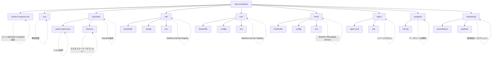

# MCP Docker環境セットアップガイド

## 概要

このドキュメントでは、Docker ComposeによるMCP模擬環境の構築手順を説明します。本環境は開発・テスト用途を想定しており、すべてのコンポーネントがコンテナ化されています。

## ディレクトリ構造



## Docker Compose設定

### メインのdocker-compose.yml

```yaml
version: '3.8'

services:
  # PostgreSQLデータベース
  postgres:
    image: postgres:15-alpine
    container_name: mcp-postgres
    environment:
      POSTGRES_USER: ${DB_USER:-mcp}
      POSTGRES_PASSWORD: ${DB_PASSWORD:-mcp_password}
      POSTGRES_DB: ${DB_NAME:-mcp_db}
    volumes:
      - postgres_data:/var/lib/postgresql/data
      - ./postgres/init.sql:/docker-entrypoint-initdb.d/init.sql
    ports:
      - "5432:5432"
    networks:
      - mcp-network
    healthcheck:
      test: ["CMD-SHELL", "pg_isready -U ${DB_USER:-mcp}"]
      interval: 10s
      timeout: 5s
      retries: 5

  # Redis（キャッシュ・セッション管理）
  redis:
    image: redis:7-alpine
    container_name: mcp-redis
    command: redis-server --requirepass ${REDIS_PASSWORD:-redis_password}
    ports:
      - "6379:6379"
    networks:
      - mcp-network
    healthcheck:
      test: ["CMD", "redis-cli", "ping"]
      interval: 10s
      timeout: 5s
      retries: 5

  # Keycloak（Identity Broker）
  keycloak:
    image: quay.io/keycloak/keycloak:22.0
    container_name: mcp-keycloak
    environment:
      KC_DB: postgres
      KC_DB_URL_HOST: postgres
      KC_DB_URL_DATABASE: keycloak
      KC_DB_USERNAME: ${DB_USER:-mcp}
      KC_DB_PASSWORD: ${DB_PASSWORD:-mcp_password}
      KC_HTTP_ENABLED: "true"
      KC_HOSTNAME_STRICT: "false"
      KC_PROXY: edge
      KEYCLOAK_ADMIN: ${KEYCLOAK_ADMIN:-admin}
      KEYCLOAK_ADMIN_PASSWORD: ${KEYCLOAK_ADMIN_PASSWORD:-admin}
    volumes:
      - ./keycloak/realm-export.json:/opt/keycloak/data/import/realm-export.json
    command:
      - start-dev
      - --import-realm
    ports:
      - "8080:8080"
    depends_on:
      postgres:
        condition: service_healthy
    networks:
      - mcp-network

  # Maritime Identity Registry
  mir:
    build:
      context: ./mir
      dockerfile: Dockerfile
    container_name: mcp-mir
    environment:
      DB_HOST: postgres
      DB_PORT: 5432
      DB_NAME: mir_db
      DB_USER: ${DB_USER:-mcp}
      DB_PASSWORD: ${DB_PASSWORD:-mcp_password}
      KEYCLOAK_URL: http://keycloak:8080
      KEYCLOAK_REALM: mcp
      REDIS_HOST: redis
      REDIS_PASSWORD: ${REDIS_PASSWORD:-redis_password}
    volumes:
      - ./mir/config:/app/config
      - mir_data:/app/data
    ports:
      - "8081:8081"
    depends_on:
      - postgres
      - redis
      - keycloak
    networks:
      - mcp-network
    healthcheck:
      test: ["CMD", "curl", "-f", "http://localhost:8081/health"]
      interval: 30s
      timeout: 10s
      retries: 3

  # Maritime Service Registry
  msr:
    build:
      context: ./msr
      dockerfile: Dockerfile
    container_name: mcp-msr
    environment:
      DB_HOST: postgres
      DB_PORT: 5432
      DB_NAME: msr_db
      DB_USER: ${DB_USER:-mcp}
      DB_PASSWORD: ${DB_PASSWORD:-mcp_password}
      MIR_URL: http://mir:8081
      KEYCLOAK_URL: http://keycloak:8080
      KEYCLOAK_REALM: mcp
    volumes:
      - ./msr/config:/app/config
      - msr_data:/app/data
    ports:
      - "8082:8082"
    depends_on:
      - postgres
      - mir
    networks:
      - mcp-network
    healthcheck:
      test: ["CMD", "curl", "-f", "http://localhost:8082/health"]
      interval: 30s
      timeout: 10s
      retries: 3

  # メッセージブローカー（Kafka）
  kafka:
    image: confluentinc/cp-kafka:7.5.0
    container_name: mcp-kafka
    environment:
      KAFKA_BROKER_ID: 1
      KAFKA_ZOOKEEPER_CONNECT: zookeeper:2181
      KAFKA_ADVERTISED_LISTENERS: PLAINTEXT://kafka:9092
      KAFKA_OFFSETS_TOPIC_REPLICATION_FACTOR: 1
      KAFKA_TRANSACTION_STATE_LOG_MIN_ISR: 1
      KAFKA_TRANSACTION_STATE_LOG_REPLICATION_FACTOR: 1
    ports:
      - "9092:9092"
    depends_on:
      - zookeeper
    networks:
      - mcp-network

  zookeeper:
    image: confluentinc/cp-zookeeper:7.5.0
    container_name: mcp-zookeeper
    environment:
      ZOOKEEPER_CLIENT_PORT: 2181
      ZOOKEEPER_TICK_TIME: 2000
    ports:
      - "2181:2181"
    networks:
      - mcp-network

  # Maritime Messaging Service
  mms:
    build:
      context: ./mms
      dockerfile: Dockerfile
    container_name: mcp-mms
    environment:
      KAFKA_BOOTSTRAP_SERVERS: kafka:9092
      REDIS_HOST: redis
      REDIS_PASSWORD: ${REDIS_PASSWORD:-redis_password}
      MIR_URL: http://mir:8081
      KEYCLOAK_URL: http://keycloak:8080
      KEYCLOAK_REALM: mcp
    volumes:
      - ./mms/config:/app/config
      - mms_data:/app/data
    ports:
      - "8083:8083"
    depends_on:
      - kafka
      - redis
      - mir
    networks:
      - mcp-network
    healthcheck:
      test: ["CMD", "curl", "-f", "http://localhost:8083/health"]
      interval: 30s
      timeout: 10s
      retries: 3

  # Nginx リバースプロキシ
  nginx:
    image: nginx:alpine
    container_name: mcp-nginx
    volumes:
      - ./nginx/nginx.conf:/etc/nginx/nginx.conf
      - ./nginx/ssl:/etc/nginx/ssl
    ports:
      - "80:80"
      - "443:443"
    depends_on:
      - keycloak
      - mir
      - msr
      - mms
    networks:
      - mcp-network

  # 管理ポータル（オプション）
  portal:
    build:
      context: ./portal
      dockerfile: Dockerfile
    container_name: mcp-portal
    environment:
      API_BASE_URL: http://nginx
      KEYCLOAK_URL: http://keycloak:8080
      KEYCLOAK_REALM: mcp
      KEYCLOAK_CLIENT_ID: mcp-portal
    ports:
      - "3000:3000"
    depends_on:
      - nginx
    networks:
      - mcp-network

volumes:
  postgres_data:
  mir_data:
  msr_data:
  mms_data:

networks:
  mcp-network:
    driver: bridge
```

### 環境変数ファイル（.env）

```bash
# データベース設定
DB_USER=mcp
DB_PASSWORD=mcp_secure_password
DB_NAME=mcp_db

# Redis設定
REDIS_PASSWORD=redis_secure_password

# Keycloak設定
KEYCLOAK_ADMIN=admin
KEYCLOAK_ADMIN_PASSWORD=admin_secure_password

# セキュリティ設定
JWT_SECRET=your_jwt_secret_key
ENCRYPTION_KEY=your_encryption_key

# ログレベル
LOG_LEVEL=info

# 環境
ENVIRONMENT=development
```

## 各コンポーネントのDockerfile例

### MIR Dockerfile

```dockerfile
FROM openjdk:17-slim

# アプリケーションディレクトリ
WORKDIR /app

# 依存関係のコピー
COPY pom.xml .
COPY src ./src

# ビルドツールのインストールとビルド
RUN apt-get update && apt-get install -y maven \
    && mvn clean package \
    && apt-get remove -y maven \
    && apt-get autoremove -y \
    && rm -rf /var/lib/apt/lists/*

# 実行可能JARの移動
RUN mv target/*.jar app.jar

# ポート公開
EXPOSE 8081

# ヘルスチェック
HEALTHCHECK --interval=30s --timeout=3s --retries=3 \
  CMD curl -f http://localhost:8081/health || exit 1

# アプリケーション起動
ENTRYPOINT ["java", "-jar", "app.jar"]
```

### MSR Dockerfile（Node.js版）

```dockerfile
FROM node:18-alpine

# アプリケーションディレクトリ
WORKDIR /app

# 依存関係のコピーとインストール
COPY package*.json ./
RUN npm ci --only=production

# アプリケーションコードのコピー
COPY . .

# ポート公開
EXPOSE 8082

# ヘルスチェック
HEALTHCHECK --interval=30s --timeout=3s --retries=3 \
  CMD node healthcheck.js || exit 1

# アプリケーション起動
CMD ["node", "server.js"]
```

## 初期化スクリプト

### PostgreSQL初期化（postgres/init.sql）

```sql
-- Keycloak用データベース
CREATE DATABASE keycloak;

-- MIR用データベース
CREATE DATABASE mir_db;

-- MSR用データベース
CREATE DATABASE msr_db;

-- 各データベースに必要な拡張機能
\c mir_db;
CREATE EXTENSION IF NOT EXISTS "uuid-ossp";
CREATE EXTENSION IF NOT EXISTS "pgcrypto";

\c msr_db;
CREATE EXTENSION IF NOT EXISTS "uuid-ossp";
CREATE EXTENSION IF NOT EXISTS "postgis"; -- 地理空間データ用
```

### Nginx設定（nginx/nginx.conf）

```nginx
events {
    worker_connections 1024;
}

http {
    upstream keycloak {
        server keycloak:8080;
    }

    upstream mir {
        server mir:8081;
    }

    upstream msr {
        server msr:8082;
    }

    upstream mms {
        server mms:8083;
    }

    server {
        listen 80;
        server_name localhost;

        # Keycloak（認証）
        location /auth/ {
            proxy_pass http://keycloak/;
            proxy_set_header Host $host;
            proxy_set_header X-Real-IP $remote_addr;
            proxy_set_header X-Forwarded-For $proxy_add_x_forwarded_for;
            proxy_set_header X-Forwarded-Proto $scheme;
        }

        # MIR API
        location /api/mir/ {
            proxy_pass http://mir/;
            proxy_set_header Host $host;
            proxy_set_header X-Real-IP $remote_addr;
            proxy_set_header X-Forwarded-For $proxy_add_x_forwarded_for;
            proxy_set_header X-Forwarded-Proto $scheme;
        }

        # MSR API
        location /api/msr/ {
            proxy_pass http://msr/;
            proxy_set_header Host $host;
            proxy_set_header X-Real-IP $remote_addr;
            proxy_set_header X-Forwarded-For $proxy_add_x_forwarded_for;
            proxy_set_header X-Forwarded-Proto $scheme;
        }

        # MMS API
        location /api/mms/ {
            proxy_pass http://mms/;
            proxy_set_header Host $host;
            proxy_set_header X-Real-IP $remote_addr;
            proxy_set_header X-Forwarded-For $proxy_add_x_forwarded_for;
            proxy_set_header X-Forwarded-Proto $scheme;
            
            # WebSocket support
            proxy_http_version 1.1;
            proxy_set_header Upgrade $http_upgrade;
            proxy_set_header Connection "upgrade";
        }
    }
}
```

## 起動と管理

### 環境の起動

```bash
# すべてのサービスを起動
docker-compose up -d

# ログの確認
docker-compose logs -f

# 特定のサービスのログ
docker-compose logs -f mir
```

### サービスの管理

```bash
# サービスの状態確認
docker-compose ps

# サービスの再起動
docker-compose restart mir

# サービスの停止
docker-compose stop

# すべてのリソースの削除
docker-compose down -v
```

### スケーリング

```bash
# MSRを3インスタンスに拡張
docker-compose up -d --scale msr=3
```

## モニタリング（オプション）

### Prometheusの追加

```yaml
# docker-compose.yml に追加
prometheus:
  image: prom/prometheus:latest
  container_name: mcp-prometheus
  volumes:
    - ./monitoring/prometheus/prometheus.yml:/etc/prometheus/prometheus.yml
    - prometheus_data:/prometheus
  ports:
    - "9090:9090"
  networks:
    - mcp-network
```

### Grafanaの追加

```yaml
# docker-compose.yml に追加
grafana:
  image: grafana/grafana:latest
  container_name: mcp-grafana
  environment:
    - GF_SECURITY_ADMIN_PASSWORD=admin
  volumes:
    - grafana_data:/var/lib/grafana
    - ./monitoring/grafana/dashboards:/etc/grafana/provisioning/dashboards
  ports:
    - "3001:3000"
  networks:
    - mcp-network
```

## トラブルシューティング

### よくある問題

1. **コンテナが起動しない**
   ```bash
   # ログを確認
   docker-compose logs [service_name]
   
   # ヘルスチェックの状態を確認
   docker-compose ps
   ```

2. **データベース接続エラー**
   ```bash
   # PostgreSQLコンテナに接続
   docker exec -it mcp-postgres psql -U mcp
   
   # データベース一覧を確認
   \l
   ```

3. **ネットワーク接続の問題**
   ```bash
   # コンテナ間の接続をテスト
   docker exec -it mcp-mir ping postgres
   ```

## セキュリティの考慮事項

1. **本番環境では必ず以下を実施**：
   - 強力なパスワードの使用
   - SSL/TLS証明書の適切な設定
   - ファイアウォールルールの設定
   - 不要なポートの非公開化

2. **定期的なアップデート**：
   - ベースイメージの更新
   - 依存関係の更新
   - セキュリティパッチの適用

## まとめ

このDocker環境により、MCP模擬環境を簡単に構築・管理できます。開発やテストの際は、必要に応じて設定を調整してください。本番環境への移行時は、セキュリティとパフォーマンスの最適化を必ず行ってください。