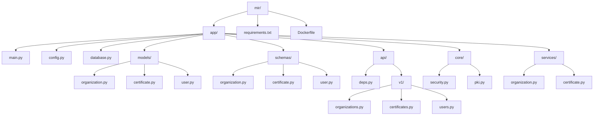

# MCP各コンポーネント実装例

## 概要

このドキュメントでは、MCP（Maritime Connectivity Platform）の各コアコンポーネントの基本的な実装例を提供します。これらの例は、模擬環境構築の出発点として使用できます。

## 1. Maritime Identity Registry (MIR) 実装例

### FastAPI（Python）による実装

#### プロジェクト構造



#### main.py
```python
from fastapi import FastAPI, Depends
from fastapi.middleware.cors import CORSMiddleware
from fastapi.security import HTTPBearer
from contextlib import asynccontextmanager

from app.api.v1 import organizations, certificates, users
from app.database import create_tables
from app.config import settings

# アプリケーションライフサイクル
@asynccontextmanager
async def lifespan(app: FastAPI):
    # 起動時
    await create_tables()
    yield
    # 終了時
    pass

# FastAPIアプリケーション
app = FastAPI(
    title="Maritime Identity Registry",
    description="MCP Identity Registry Service",
    version="1.0.0",
    lifespan=lifespan
)

# セキュリティ
security = HTTPBearer()

# CORS設定
app.add_middleware(
    CORSMiddleware,
    allow_origins=settings.ALLOWED_ORIGINS,
    allow_credentials=True,
    allow_methods=["*"],
    allow_headers=["*"],
)

# ルーター登録
app.include_router(
    organizations.router,
    prefix="/api/v1/organizations",
    tags=["organizations"],
    dependencies=[Depends(security)]
)
app.include_router(
    certificates.router,
    prefix="/api/v1/certificates",
    tags=["certificates"],
    dependencies=[Depends(security)]
)
app.include_router(
    users.router,
    prefix="/api/v1/users",
    tags=["users"],
    dependencies=[Depends(security)]
)

# ヘルスチェック
@app.get("/health")
async def health_check():
    return {"status": "UP", "service": "MIR"}

if __name__ == "__main__":
    import uvicorn
    uvicorn.run("main:app", host="0.0.0.0", port=8081, reload=True)
```

#### models/organization.py
```python
from sqlalchemy import Column, String, DateTime, Text
from sqlalchemy.orm import relationship
from datetime import datetime

from app.database import Base

class Organization(Base):
    __tablename__ = "organizations"
    
    mrn = Column(String, primary_key=True, index=True)  # Maritime Resource Name
    name = Column(String, nullable=False)
    country = Column(String, nullable=False)
    description = Column(Text)
    contact_email = Column(String)
    website = Column(String)
    created_at = Column(DateTime, default=datetime.utcnow)
    updated_at = Column(DateTime, default=datetime.utcnow, onupdate=datetime.utcnow)
    
    # リレーション
    certificates = relationship("Certificate", back_populates="organization")
    users = relationship("User", back_populates="organization")
```

#### schemas/organization.py
```python
from pydantic import BaseModel, Field, validator
from datetime import datetime
from typing import Optional, List

class OrganizationBase(BaseModel):
    name: str = Field(..., min_length=1, max_length=255)
    country: str = Field(..., min_length=2, max_length=3)
    description: Optional[str] = None
    contact_email: Optional[str] = None
    website: Optional[str] = None

class OrganizationCreate(OrganizationBase):
    mrn: str = Field(..., regex=r"^urn:mrn:mcp:org:")
    
    @validator('mrn')
    def validate_mrn(cls, v):
        if not v.startswith('urn:mrn:mcp:org:'):
            raise ValueError('MRN must start with urn:mrn:mcp:org:')
        return v

class OrganizationUpdate(OrganizationBase):
    name: Optional[str] = None
    country: Optional[str] = None

class Organization(OrganizationBase):
    mrn: str
    created_at: datetime
    updated_at: datetime
    
    class Config:
        from_attributes = True

class OrganizationList(BaseModel):
    count: int
    organizations: List[Organization]
```

#### api/v1/organizations.py
```python
from fastapi import APIRouter, Depends, HTTPException, Query
from sqlalchemy.orm import Session
from typing import List, Optional

from app.database import get_db
from app.schemas.organization import Organization, OrganizationCreate, OrganizationUpdate, OrganizationList
from app.services.organization import OrganizationService
from app.core.security import require_role

router = APIRouter()

@router.get("/", response_model=OrganizationList)
async def get_organizations(
    skip: int = Query(0, ge=0),
    limit: int = Query(100, ge=1, le=1000),
    country: Optional[str] = Query(None),
    db: Session = Depends(get_db),
    current_user = Depends(require_role("MIR_USER"))
):
    """組織一覧を取得"""
    service = OrganizationService(db)
    organizations, total = await service.get_organizations(
        skip=skip, limit=limit, country=country
    )
    return OrganizationList(count=total, organizations=organizations)

@router.get("/{mrn}", response_model=Organization)
async def get_organization(
    mrn: str,
    db: Session = Depends(get_db),
    current_user = Depends(require_role("MIR_USER"))
):
    """特定の組織を取得"""
    service = OrganizationService(db)
    organization = await service.get_organization(mrn)
    if not organization:
        raise HTTPException(status_code=404, detail="Organization not found")
    return organization

@router.post("/", response_model=Organization, status_code=201)
async def create_organization(
    organization: OrganizationCreate,
    db: Session = Depends(get_db),
    current_user = Depends(require_role("MIR_ADMIN"))
):
    """新しい組織を作成"""
    service = OrganizationService(db)
    
    # 既存チェック
    existing = await service.get_organization(organization.mrn)
    if existing:
        raise HTTPException(status_code=409, detail="Organization already exists")
    
    return await service.create_organization(organization)

@router.put("/{mrn}", response_model=Organization)
async def update_organization(
    mrn: str,
    organization: OrganizationUpdate,
    db: Session = Depends(get_db),
    current_user = Depends(require_role("MIR_ADMIN"))
):
    """組織情報を更新"""
    service = OrganizationService(db)
    updated = await service.update_organization(mrn, organization)
    if not updated:
        raise HTTPException(status_code=404, detail="Organization not found")
    return updated

@router.delete("/{mrn}", status_code=204)
async def delete_organization(
    mrn: str,
    db: Session = Depends(get_db),
    current_user = Depends(require_role("MIR_ADMIN"))
):
    """組織を削除"""
    service = OrganizationService(db)
    success = await service.delete_organization(mrn)
    if not success:
        raise HTTPException(status_code=404, detail="Organization not found")
```

#### core/pki.py（PKI証明書管理）
```python
from cryptography import x509
from cryptography.x509.oid import NameOID
from cryptography.hazmat.primitives import hashes, serialization
from cryptography.hazmat.primitives.asymmetric import rsa
from datetime import datetime, timedelta
from typing import Tuple, Optional
import uuid

class PKIService:
    """PKI証明書管理サービス"""
    
    def __init__(self):
        self.key_size = 2048
        self.hash_algorithm = hashes.SHA256()
    
    def generate_key_pair(self) -> Tuple[rsa.RSAPrivateKey, rsa.RSAPublicKey]:
        """RSAキーペアを生成"""
        private_key = rsa.generate_private_key(
            public_exponent=65537,
            key_size=self.key_size
        )
        public_key = private_key.public_key()
        return private_key, public_key
    
    def generate_certificate(
        self,
        subject_name: str,
        subject_mrn: str,
        validity_days: int = 365,
        ca_cert: Optional[x509.Certificate] = None,
        ca_private_key: Optional[rsa.RSAPrivateKey] = None
    ) -> Tuple[x509.Certificate, rsa.RSAPrivateKey]:
        """X.509証明書を生成"""
        
        # キーペア生成
        private_key, public_key = self.generate_key_pair()
        
        # Subject Name構築
        subject = x509.Name([
            x509.NameAttribute(NameOID.COMMON_NAME, subject_name),
            x509.NameAttribute(NameOID.ORGANIZATION_NAME, subject_mrn),
        ])
        
        # Issuer設定
        if ca_cert:
            issuer = ca_cert.subject
            signing_key = ca_private_key
        else:
            issuer = subject  # 自己署名
            signing_key = private_key
        
        # 証明書ビルダー
        builder = x509.CertificateBuilder()
        builder = builder.subject_name(subject)
        builder = builder.issuer_name(issuer)
        builder = builder.public_key(public_key)
        builder = builder.serial_number(int(uuid.uuid4()))
        builder = builder.not_valid_before(datetime.utcnow())
        builder = builder.not_valid_after(
            datetime.utcnow() + timedelta(days=validity_days)
        )
        
        # 拡張属性
        builder = builder.add_extension(
            x509.SubjectAlternativeName([
                x509.UniformResourceIdentifier(subject_mrn),
            ]),
            critical=False,
        )
        
        # 証明書生成
        certificate = builder.sign(signing_key, self.hash_algorithm)
        
        return certificate, private_key
    
    def verify_certificate(
        self,
        cert: x509.Certificate,
        ca_public_key: Optional[rsa.RSAPublicKey] = None
    ) -> bool:
        """証明書の検証"""
        try:
            # 有効期限チェック
            now = datetime.utcnow()
            if now < cert.not_valid_before or now > cert.not_valid_after:
                return False
            
            # 署名検証
            if ca_public_key:
                ca_public_key.verify(
                    cert.signature,
                    cert.tbs_certificate_bytes,
                    self.hash_algorithm
                )
            else:
                # 自己署名証明書の場合
                cert.public_key().verify(
                    cert.signature,
                    cert.tbs_certificate_bytes,
                    self.hash_algorithm
                )
            
            return True
        except Exception:
            return False
    
    def export_certificate_pem(self, cert: x509.Certificate) -> str:
        """証明書をPEM形式でエクスポート"""
        return cert.public_bytes(serialization.Encoding.PEM).decode()
    
    def export_private_key_pem(self, private_key: rsa.RSAPrivateKey) -> str:
        """秘密鍵をPEM形式でエクスポート"""
        return private_key.private_bytes(
            encoding=serialization.Encoding.PEM,
            format=serialization.PrivateFormat.PKCS8,
            encryption_algorithm=serialization.NoEncryption()
        ).decode()
    
    def import_certificate_pem(self, pem_data: str) -> x509.Certificate:
        """PEM形式の証明書をインポート"""
        return x509.load_pem_x509_certificate(pem_data.encode())
    
    def import_private_key_pem(self, pem_data: str) -> rsa.RSAPrivateKey:
        """PEM形式の秘密鍵をインポート"""
        return serialization.load_pem_private_key(
            pem_data.encode(),
            password=None
        )
```

#### core/security.py（認証・認可）
```python
from fastapi import Depends, HTTPException, status
from fastapi.security import HTTPBearer, HTTPAuthorizationCredentials
from jose import jwt, JWTError
from typing import Optional, List
import httpx

from app.config import settings

security = HTTPBearer()

class TokenPayload:
    def __init__(self, payload: dict):
        self.sub = payload.get("sub")
        self.realm_access = payload.get("realm_access", {})
        self.resource_access = payload.get("resource_access", {})
        self.preferred_username = payload.get("preferred_username")
        self.email = payload.get("email")
        self.name = payload.get("name")
        self.org = payload.get("org")

async def get_current_user(
    credentials: HTTPAuthorizationCredentials = Depends(security)
) -> TokenPayload:
    """JWTトークンから現在のユーザー情報を取得"""
    
    try:
        # Keycloakの公開鍵を取得
        jwks_url = f"{settings.KEYCLOAK_URL}/realms/{settings.KEYCLOAK_REALM}/protocol/openid_connect/certs"
        
        async with httpx.AsyncClient() as client:
            response = await client.get(jwks_url)
            jwks = response.json()
        
        # JWTトークンを検証
        payload = jwt.decode(
            credentials.credentials,
            jwks,
            algorithms=["RS256"],
            audience="account",
            issuer=f"{settings.KEYCLOAK_URL}/realms/{settings.KEYCLOAK_REALM}"
        )
        
        return TokenPayload(payload)
        
    except JWTError:
        raise HTTPException(
            status_code=status.HTTP_401_UNAUTHORIZED,
            detail="Could not validate credentials",
            headers={"WWW-Authenticate": "Bearer"},
        )

def require_role(required_role: str):
    """指定されたロールを要求するデコレータ"""
    def role_checker(current_user: TokenPayload = Depends(get_current_user)):
        user_roles = current_user.realm_access.get("roles", [])
        if required_role not in user_roles:
            raise HTTPException(
                status_code=status.HTTP_403_FORBIDDEN,
                detail="Insufficient permissions"
            )
        return current_user
    return role_checker

def require_org_access(org_mrn: str):
    """組織アクセス権限をチェック"""
    def org_checker(current_user: TokenPayload = Depends(get_current_user)):
        user_org = current_user.org
        if user_org != org_mrn and "MIR_ADMIN" not in current_user.realm_access.get("roles", []):
            raise HTTPException(
                status_code=status.HTTP_403_FORBIDDEN,
                detail="Access denied to this organization"
            )
        return current_user
    return org_checker
```

#### config.py
```python
from pydantic_settings import BaseSettings
from typing import List

class Settings(BaseSettings):
    # データベース設定
    DB_HOST: str = "localhost"
    DB_PORT: int = 5432
    DB_USER: str = "mcp"
    DB_PASSWORD: str = "mcp_password"
    DB_NAME: str = "mir_db"
    
    # Keycloak設定
    KEYCLOAK_URL: str = "http://localhost:8080"
    KEYCLOAK_REALM: str = "mcp"
    
    # CORS設定
    ALLOWED_ORIGINS: List[str] = ["*"]
    
    # アプリケーション設定
    APP_NAME: str = "MCP Identity Registry"
    VERSION: str = "1.0.0"
    DEBUG: bool = False
    
    @property
    def database_url(self) -> str:
        return f"postgresql://{self.DB_USER}:{self.DB_PASSWORD}@{self.DB_HOST}:{self.DB_PORT}/{self.DB_NAME}"
    
    class Config:
        env_file = ".env"

settings = Settings()
```

#### requirements.txt
```
fastapi==0.104.1
uvicorn[standard]==0.24.0
sqlalchemy==2.0.23
alembic==1.13.0
psycopg2-binary==2.9.9
pydantic==2.5.0
pydantic-settings==2.1.0
python-jose[cryptography]==3.3.0
python-multipart==0.0.6
httpx==0.25.2
cryptography==41.0.8
```

## 2. Maritime Service Registry (MSR) 実装例

### FastAPI（Python）による実装

#### プロジェクト構造
```
msr/
├── app/
│   ├── main.py
│   ├── config.py
│   ├── database.py
│   ├── models/
│   │   ├── __init__.py
│   │   ├── service_specification.py
│   │   ├── service_instance.py
│   │   └── technical_design.py
│   ├── schemas/
│   │   ├── __init__.py
│   │   ├── service_specification.py
│   │   ├── service_instance.py
│   │   └── search.py
│   ├── api/
│   │   ├── __init__.py
│   │   ├── deps.py
│   │   └── v1/
│   │       ├── __init__.py
│   │       ├── service_specifications.py
│   │       ├── service_instances.py
│   │       └── search.py
│   ├── core/
│   │   ├── __init__.py
│   │   ├── security.py
│   │   └── geo_utils.py
│   └── services/
│       ├── __init__.py
│       ├── service_specification.py
│       ├── service_instance.py
│       └── search.py
├── requirements.txt
└── Dockerfile
```

#### main.py
```python
from fastapi import FastAPI, Depends
from fastapi.middleware.cors import CORSMiddleware
from fastapi.security import HTTPBearer
from contextlib import asynccontextmanager

from app.api.v1 import service_specifications, service_instances, search
from app.database import create_tables
from app.config import settings

# アプリケーションライフサイクル
@asynccontextmanager
async def lifespan(app: FastAPI):
    # 起動時
    await create_tables()
    yield
    # 終了時
    pass

# FastAPIアプリケーション
app = FastAPI(
    title="Maritime Service Registry",
    description="MCP Service Registry for service discovery and management",
    version="1.0.0",
    lifespan=lifespan
)

# セキュリティ
security = HTTPBearer()

# CORS設定
app.add_middleware(
    CORSMiddleware,
    allow_origins=settings.ALLOWED_ORIGINS,
    allow_credentials=True,
    allow_methods=["*"],
    allow_headers=["*"],
)

# ルーター登録
app.include_router(
    service_specifications.router,
    prefix="/api/v1/serviceSpecifications",
    tags=["service-specifications"],
    dependencies=[Depends(security)]
)
app.include_router(
    service_instances.router,
    prefix="/api/v1/serviceInstances",
    tags=["service-instances"],
    dependencies=[Depends(security)]
)
app.include_router(
    search.router,
    prefix="/api/v1/search",
    tags=["search"],
    dependencies=[Depends(security)]
)

# ヘルスチェック
@app.get("/health")
async def health_check():
    return {"status": "UP", "service": "MSR"}

if __name__ == "__main__":
    import uvicorn
    uvicorn.run("main:app", host="0.0.0.0", port=8082, reload=True)
```

#### models/service_specification.py
```python
from sqlalchemy import Column, String, DateTime, Text, Enum as SQLEnum, JSON
from sqlalchemy.orm import relationship
from datetime import datetime
import enum

from app.database import Base

class ServiceStatus(str, enum.Enum):
    DRAFT = "draft"
    RELEASED = "released"
    DEPRECATED = "deprecated"

class ServiceSpecification(Base):
    __tablename__ = "service_specifications"
    
    mrn = Column(String, primary_key=True, index=True)
    name = Column(String, nullable=False)
    version = Column(String, nullable=False)
    description = Column(Text, nullable=False)
    keywords = Column(JSON)  # リスト形式で保存
    status = Column(SQLEnum(ServiceStatus), default=ServiceStatus.DRAFT)
    organization_mrn = Column(String, nullable=False, index=True)
    specification_document = Column(Text)  # XMLまたはJSON仕様書
    created_at = Column(DateTime, default=datetime.utcnow)
    updated_at = Column(DateTime, default=datetime.utcnow, onupdate=datetime.utcnow)
    
    # リレーション
    service_instances = relationship("ServiceInstance", back_populates="service_specification")
    technical_designs = relationship("TechnicalDesign", back_populates="service_specification")
```

#### models/service_instance.py
```python
from sqlalchemy import Column, String, DateTime, Enum as SQLEnum, JSON, Float, ForeignKey
from sqlalchemy.orm import relationship
from datetime import datetime
import enum

from app.database import Base

class EndpointType(str, enum.Enum):
    REST = "REST"
    SOAP = "SOAP"
    MMS = "MMS"
    OTHER = "OTHER"

class InstanceStatus(str, enum.Enum):
    ACTIVE = "active"
    INACTIVE = "inactive"
    MAINTENANCE = "maintenance"

class ServiceInstance(Base):
    __tablename__ = "service_instances"
    
    mrn = Column(String, primary_key=True, index=True)
    name = Column(String, nullable=False)
    version = Column(String, nullable=False)
    service_specification_mrn = Column(String, ForeignKey("service_specifications.mrn"), nullable=False, index=True)
    organization_mrn = Column(String, nullable=False, index=True)
    endpoint_uri = Column(String, nullable=False)
    endpoint_type = Column(SQLEnum(EndpointType), default=EndpointType.REST)
    status = Column(SQLEnum(InstanceStatus), default=InstanceStatus.ACTIVE)
    
    # 地理空間データ（WKT形式）
    coverage_area_wkt = Column(Text)
    
    # 境界ボックス（検索最適化用）
    bbox_min_lat = Column(Float)
    bbox_max_lat = Column(Float)
    bbox_min_lng = Column(Float)
    bbox_max_lng = Column(Float)
    
    metadata = Column(JSON)
    last_health_check = Column(DateTime)
    created_at = Column(DateTime, default=datetime.utcnow)
    updated_at = Column(DateTime, default=datetime.utcnow, onupdate=datetime.utcnow)
    
    # リレーション
    service_specification = relationship("ServiceSpecification", back_populates="service_instances")
```

#### schemas/service_specification.py
```python
from pydantic import BaseModel, Field, validator
from datetime import datetime
from typing import Optional, List
from enum import Enum

class ServiceStatus(str, Enum):
    DRAFT = "draft"
    RELEASED = "released"
    DEPRECATED = "deprecated"

class ServiceSpecificationBase(BaseModel):
    name: str = Field(..., min_length=1, max_length=255)
    version: str = Field(..., min_length=1, max_length=50)
    description: str = Field(..., min_length=1)
    keywords: Optional[List[str]] = []
    status: ServiceStatus = ServiceStatus.DRAFT
    organization_mrn: str = Field(..., regex=r"^urn:mrn:mcp:org:")
    specification_document: Optional[str] = None

class ServiceSpecificationCreate(ServiceSpecificationBase):
    mrn: str = Field(..., regex=r"^urn:mrn:mcp:service:")
    
    @validator('mrn')
    def validate_mrn(cls, v):
        if not v.startswith('urn:mrn:mcp:service:'):
            raise ValueError('MRN must start with urn:mrn:mcp:service:')
        return v

class ServiceSpecificationUpdate(ServiceSpecificationBase):
    name: Optional[str] = None
    version: Optional[str] = None
    description: Optional[str] = None
    status: Optional[ServiceStatus] = None

class ServiceSpecification(ServiceSpecificationBase):
    mrn: str
    created_at: datetime
    updated_at: datetime
    
    class Config:
        from_attributes = True

class ServiceSpecificationList(BaseModel):
    count: int
    specifications: List[ServiceSpecification]
```

#### schemas/service_instance.py
```python
from pydantic import BaseModel, Field, validator
from datetime import datetime
from typing import Optional, List, Dict, Any
from enum import Enum

class EndpointType(str, Enum):
    REST = "REST"
    SOAP = "SOAP"
    MMS = "MMS"
    OTHER = "OTHER"

class InstanceStatus(str, Enum):
    ACTIVE = "active"
    INACTIVE = "inactive"
    MAINTENANCE = "maintenance"

class ServiceInstanceBase(BaseModel):
    name: str = Field(..., min_length=1, max_length=255)
    version: str = Field(..., min_length=1, max_length=50)
    service_specification_mrn: str = Field(..., regex=r"^urn:mrn:mcp:service:")
    organization_mrn: str = Field(..., regex=r"^urn:mrn:mcp:org:")
    endpoint_uri: str = Field(..., min_length=1)
    endpoint_type: EndpointType = EndpointType.REST
    status: InstanceStatus = InstanceStatus.ACTIVE
    coverage_area_wkt: Optional[str] = None
    metadata: Optional[Dict[str, Any]] = {}

class ServiceInstanceCreate(ServiceInstanceBase):
    mrn: str = Field(..., regex=r"^urn:mrn:mcp:instance:")
    
    @validator('mrn')
    def validate_mrn(cls, v):
        if not v.startswith('urn:mrn:mcp:instance:'):
            raise ValueError('MRN must start with urn:mrn:mcp:instance:')
        return v

class ServiceInstanceUpdate(ServiceInstanceBase):
    name: Optional[str] = None
    version: Optional[str] = None
    endpoint_uri: Optional[str] = None
    status: Optional[InstanceStatus] = None

class ServiceInstance(ServiceInstanceBase):
    mrn: str
    last_health_check: Optional[datetime] = None
    created_at: datetime
    updated_at: datetime
    
    class Config:
        from_attributes = True

class ServiceInstanceList(BaseModel):
    count: int
    instances: List[ServiceInstance]
```

#### api/v1/search.py
```python
from fastapi import APIRouter, Depends, Query
from sqlalchemy.orm import Session
from typing import Optional, List
from shapely.geometry import Point
from shapely.wkt import loads as wkt_loads

from app.database import get_db
from app.schemas.service_instance import ServiceInstanceList
from app.services.search import SearchService
from app.core.security import require_role

router = APIRouter()

@router.get("/services", response_model=ServiceInstanceList)
async def search_services(
    keywords: Optional[str] = Query(None, description="検索キーワード"),
    organization_mrn: Optional[str] = Query(None, description="組織MRN"),
    location: Optional[str] = Query(None, description="位置（lng,lat形式）"),
    radius: Optional[float] = Query(None, description="検索半径（km）"),
    service_type: Optional[str] = Query(None, description="サービスタイプ"),
    status: str = Query("active", description="インスタンスステータス"),
    skip: int = Query(0, ge=0),
    limit: int = Query(100, ge=1, le=1000),
    db: Session = Depends(get_db),
    current_user = Depends(require_role("MSR_USER"))
):
    """サービスインスタンスを検索"""
    
    search_service = SearchService(db)
    
    # 地理的検索パラメータの処理
    search_point = None
    if location:
        try:
            lng, lat = map(float, location.split(','))
            search_point = Point(lng, lat)
        except ValueError:
            raise HTTPException(status_code=400, detail="Invalid location format")
    
    instances, total = await search_service.search_services(
        keywords=keywords,
        organization_mrn=organization_mrn,
        search_point=search_point,
        radius_km=radius,
        service_type=service_type,
        status=status,
        skip=skip,
        limit=limit
    )
    
    return ServiceInstanceList(count=total, instances=instances)

@router.get("/specifications")
async def search_specifications(
    keywords: Optional[str] = Query(None),
    organization_mrn: Optional[str] = Query(None),
    status: Optional[str] = Query(None),
    skip: int = Query(0, ge=0),
    limit: int = Query(100, ge=1, le=1000),
    db: Session = Depends(get_db),
    current_user = Depends(require_role("MSR_USER"))
):
    """サービス仕様を検索"""
    
    search_service = SearchService(db)
    specifications, total = await search_service.search_specifications(
        keywords=keywords,
        organization_mrn=organization_mrn,
        status=status,
        skip=skip,
        limit=limit
    )
    
    return {"count": total, "specifications": specifications}
```

#### services/search.py
```python
from sqlalchemy.orm import Session
from sqlalchemy import and_, or_, func
from typing import Optional, List, Tuple
from shapely.geometry import Point
from shapely.wkt import loads as wkt_loads

from app.models.service_specification import ServiceSpecification
from app.models.service_instance import ServiceInstance

class SearchService:
    def __init__(self, db: Session):
        self.db = db
    
    async def search_services(
        self,
        keywords: Optional[str] = None,
        organization_mrn: Optional[str] = None,
        search_point: Optional[Point] = None,
        radius_km: Optional[float] = None,
        service_type: Optional[str] = None,
        status: str = "active",
        skip: int = 0,
        limit: int = 100
    ) -> Tuple[List[ServiceInstance], int]:
        """サービスインスタンスを検索"""
        
        query = self.db.query(ServiceInstance)
        
        # ステータスフィルタ
        query = query.filter(ServiceInstance.status == status)
        
        # 組織フィルタ
        if organization_mrn:
            query = query.filter(ServiceInstance.organization_mrn == organization_mrn)
        
        # キーワード検索（サービス仕様名と説明から検索）
        if keywords:
            spec_query = self.db.query(ServiceSpecification.mrn).filter(
                or_(
                    ServiceSpecification.name.ilike(f"%{keywords}%"),
                    ServiceSpecification.description.ilike(f"%{keywords}%"),
                    ServiceSpecification.keywords.op('@>')([keywords])
                )
            )
            spec_mrns = [spec.mrn for spec in spec_query.all()]
            query = query.filter(ServiceInstance.service_specification_mrn.in_(spec_mrns))
        
        # 地理的検索
        if search_point and radius_km:
            # まず境界ボックスで粗い絞り込み
            lat_delta = radius_km / 111.0  # 1度 ≈ 111km
            lng_delta = radius_km / (111.0 * abs(search_point.y))
            
            query = query.filter(
                and_(
                    ServiceInstance.bbox_min_lat <= search_point.y + lat_delta,
                    ServiceInstance.bbox_max_lat >= search_point.y - lat_delta,
                    ServiceInstance.bbox_min_lng <= search_point.x + lng_delta,
                    ServiceInstance.bbox_max_lng >= search_point.x - lng_delta
                )
            )
        
        # 総数取得
        total = query.count()
        
        # ページング
        instances = query.offset(skip).limit(limit).all()
        
        # 地理的検索の精密フィルタリング
        if search_point and radius_km:
            filtered_instances = []
            for instance in instances:
                if instance.coverage_area_wkt:
                    try:
                        coverage_area = wkt_loads(instance.coverage_area_wkt)
                        if coverage_area.distance(search_point) * 111.0 <= radius_km:
                            filtered_instances.append(instance)
                    except:
                        # WKT解析エラーの場合はスキップ
                        continue
                else:
                    filtered_instances.append(instance)
            instances = filtered_instances
        
        return instances, total
    
    async def search_specifications(
        self,
        keywords: Optional[str] = None,
        organization_mrn: Optional[str] = None,
        status: Optional[str] = None,
        skip: int = 0,
        limit: int = 100
    ) -> Tuple[List[ServiceSpecification], int]:
        """サービス仕様を検索"""
        
        query = self.db.query(ServiceSpecification)
        
        # 組織フィルタ
        if organization_mrn:
            query = query.filter(ServiceSpecification.organization_mrn == organization_mrn)
        
        # ステータスフィルタ
        if status:
            query = query.filter(ServiceSpecification.status == status)
        
        # キーワード検索
        if keywords:
            query = query.filter(
                or_(
                    ServiceSpecification.name.ilike(f"%{keywords}%"),
                    ServiceSpecification.description.ilike(f"%{keywords}%"),
                    ServiceSpecification.keywords.op('@>')([keywords])
                )
            )
        
        # 総数取得
        total = query.count()
        
        # ページング
        specifications = query.offset(skip).limit(limit).all()
        
        return specifications, total
```

#### core/geo_utils.py
```python
from shapely.geometry import Polygon, Point, box
from shapely.wkt import loads as wkt_loads, dumps as wkt_dumps
from typing import Tuple, Optional
import json

class GeoUtils:
    """地理空間データ処理ユーティリティ"""
    
    @staticmethod
    def wkt_to_bbox(wkt_string: str) -> Optional[Tuple[float, float, float, float]]:
        """WKT文字列から境界ボックス（min_lng, min_lat, max_lng, max_lat）を計算"""
        try:
            geometry = wkt_loads(wkt_string)
            bounds = geometry.bounds
            return bounds  # (min_lng, min_lat, max_lng, max_lat)
        except:
            return None
    
    @staticmethod
    def geojson_to_wkt(geojson: dict) -> str:
        """GeoJSONからWKT形式に変換"""
        geometry_type = geojson.get('type')
        coordinates = geojson.get('coordinates')
        
        if geometry_type == 'Polygon':
            polygon = Polygon(coordinates[0], coordinates[1:])
            return wkt_dumps(polygon)
        elif geometry_type == 'Point':
            point = Point(coordinates)
            return wkt_dumps(point)
        else:
            raise ValueError(f"Unsupported geometry type: {geometry_type}")
    
    @staticmethod
    def create_circle_polygon(center_lng: float, center_lat: float, radius_km: float, points: int = 32) -> str:
        """中心点と半径から円形ポリゴンのWKTを生成"""
        import math
        
        # 1度あたりの距離（概算）
        lat_deg_per_km = 1.0 / 111.0
        lng_deg_per_km = 1.0 / (111.0 * math.cos(math.radians(center_lat)))
        
        polygon_points = []
        for i in range(points):
            angle = 2 * math.pi * i / points
            lng = center_lng + radius_km * lng_deg_per_km * math.cos(angle)
            lat = center_lat + radius_km * lat_deg_per_km * math.sin(angle)
            polygon_points.append((lng, lat))
        
        # 最初の点で閉じる
        polygon_points.append(polygon_points[0])
        
        polygon = Polygon(polygon_points)
        return wkt_dumps(polygon)
    
    @staticmethod
    def point_in_polygon(point_lng: float, point_lat: float, polygon_wkt: str) -> bool:
        """点がポリゴン内にあるかチェック"""
        try:
            point = Point(point_lng, point_lat)
            polygon = wkt_loads(polygon_wkt)
            return polygon.contains(point)
        except:
            return False
    
    @staticmethod
    def calculate_distance(lng1: float, lat1: float, lng2: float, lat2: float) -> float:
        """2点間の距離を計算（km）"""
        point1 = Point(lng1, lat1)
        point2 = Point(lng2, lat2)
        # 簡易計算（度数 × 111km）
        return point1.distance(point2) * 111.0
```

#### requirements.txt
```
fastapi==0.104.1
uvicorn[standard]==0.24.0
sqlalchemy==2.0.23
alembic==1.13.0
psycopg2-binary==2.9.9
pydantic==2.5.0
pydantic-settings==2.1.0
python-jose[cryptography]==3.3.0
python-multipart==0.0.6
httpx==0.25.2
shapely==2.0.2
geoalchemy2==0.14.2
```

## 3. Maritime Messaging Service (MMS) 実装例

### Python/FastAPI による実装

#### プロジェクト構造
```
mms/
├── app/
│   ├── main.py
│   ├── config.py
│   ├── models/
│   │   ├── __init__.py
│   │   ├── message.py
│   │   └── routing.py
│   ├── services/
│   │   ├── __init__.py
│   │   ├── message_broker.py
│   │   ├── routing_engine.py
│   │   └── channel_manager.py
│   ├── api/
│   │   ├── __init__.py
│   │   ├── endpoints/
│   │   │   ├── messages.py
│   │   │   └── status.py
│   │   └── dependencies.py
│   └── core/
│       ├── __init__.py
│       ├── security.py
│       └── mmtp_protocol.py
├── requirements.txt
└── Dockerfile
```

#### main.py
```python
from fastapi import FastAPI, WebSocket
from fastapi.middleware.cors import CORSMiddleware
from contextlib import asynccontextmanager
import uvicorn

from app.api.endpoints import messages, status
from app.services.message_broker import MessageBroker
from app.config import settings

# Lifespan管理
@asynccontextmanager
async def lifespan(app: FastAPI):
    # 起動時
    app.state.message_broker = MessageBroker()
    await app.state.message_broker.start()
    yield
    # 終了時
    await app.state.message_broker.stop()

# FastAPIアプリケーション
app = FastAPI(
    title="Maritime Messaging Service",
    version="1.0.0",
    lifespan=lifespan
)

# CORS設定
app.add_middleware(
    CORSMiddleware,
    allow_origins=["*"],
    allow_credentials=True,
    allow_methods=["*"],
    allow_headers=["*"],
)

# ルーター登録
app.include_router(messages.router, prefix="/api/v1/messages", tags=["messages"])
app.include_router(status.router, prefix="/api/v1/status", tags=["status"])

# WebSocketエンドポイント
@app.websocket("/ws/{client_mrn}")
async def websocket_endpoint(websocket: WebSocket, client_mrn: str):
    await websocket.accept()
    broker = app.state.message_broker
    
    try:
        # クライアント登録
        await broker.register_client(client_mrn, websocket)
        
        while True:
            # メッセージ受信
            data = await websocket.receive_json()
            await broker.process_message(client_mrn, data)
            
    except Exception as e:
        print(f"WebSocket error: {e}")
    finally:
        # クライアント登録解除
        await broker.unregister_client(client_mrn)

if __name__ == "__main__":
    uvicorn.run("main:app", host="0.0.0.0", port=8083, reload=True)
```

#### message.py（メッセージモデル）
```python
from pydantic import BaseModel, Field
from datetime import datetime
from typing import Optional, Dict, Any
from enum import Enum

class MessagePriority(str, Enum):
    LOW = "low"
    NORMAL = "normal"
    HIGH = "high"
    URGENT = "urgent"

class MessageType(str, Enum):
    TEXT = "text"
    BINARY = "binary"
    POSITION_REPORT = "position_report"
    SAFETY = "safety"
    DISTRESS = "distress"

class MMTPMessage(BaseModel):
    """Maritime Message Transfer Protocol メッセージ"""
    message_id: str = Field(..., description="一意のメッセージID")
    sender_mrn: str = Field(..., description="送信者のMRN")
    recipient_mrn: str = Field(..., description="受信者のMRN")
    message_type: MessageType = Field(default=MessageType.TEXT)
    priority: MessagePriority = Field(default=MessagePriority.NORMAL)
    subject: Optional[str] = None
    body: str = Field(..., description="メッセージ本文")
    metadata: Optional[Dict[str, Any]] = None
    timestamp: datetime = Field(default_factory=datetime.utcnow)
    expiry: Optional[datetime] = None
    encryption: Optional[str] = None
    signature: Optional[str] = None

class MessageStatus(BaseModel):
    message_id: str
    status: str  # queued, routing, delivered, failed
    timestamp: datetime
    details: Optional[str] = None

class RoutingInfo(BaseModel):
    """ルーティング情報"""
    recipient_mrn: str
    available_channels: list[str]
    preferred_channel: str
    fallback_channels: list[str]
    last_known_position: Optional[Dict[str, float]] = None
```

#### message_broker.py
```python
import asyncio
from typing import Dict, List, Optional
from datetime import datetime
import json
import aioredis
from aiokafka import AIOKafkaProducer, AIOKafkaConsumer

from app.models.message import MMTPMessage, MessageStatus
from app.services.routing_engine import RoutingEngine
from app.services.channel_manager import ChannelManager
from app.config import settings

class MessageBroker:
    def __init__(self):
        self.routing_engine = RoutingEngine()
        self.channel_manager = ChannelManager()
        self.redis = None
        self.kafka_producer = None
        self.kafka_consumer = None
        self.active_connections: Dict[str, any] = {}
        
    async def start(self):
        """ブローカーの起動"""
        # Redis接続
        self.redis = await aioredis.create_redis_pool(
            settings.REDIS_URL,
            password=settings.REDIS_PASSWORD
        )
        
        # Kafkaプロデューサー
        self.kafka_producer = AIOKafkaProducer(
            bootstrap_servers=settings.KAFKA_BOOTSTRAP_SERVERS,
            value_serializer=lambda v: json.dumps(v).encode()
        )
        await self.kafka_producer.start()
        
        # Kafkaコンシューマー
        self.kafka_consumer = AIOKafkaConsumer(
            'mms-messages',
            bootstrap_servers=settings.KAFKA_BOOTSTRAP_SERVERS,
            group_id='mms-broker',
            value_deserializer=lambda v: json.loads(v.decode())
        )
        await self.kafka_consumer.start()
        
        # メッセージ処理ループを開始
        asyncio.create_task(self._process_messages())
        
    async def stop(self):
        """ブローカーの停止"""
        await self.kafka_producer.stop()
        await self.kafka_consumer.stop()
        self.redis.close()
        await self.redis.wait_closed()
        
    async def send_message(self, message: MMTPMessage) -> MessageStatus:
        """メッセージ送信"""
        try:
            # ルーティング情報取得
            routing_info = await self.routing_engine.get_routing_info(
                message.recipient_mrn
            )
            
            # メッセージをキューに追加
            await self.kafka_producer.send(
                'mms-messages',
                {
                    'message': message.dict(),
                    'routing': routing_info.dict()
                }
            )
            
            # ステータスを保存
            status = MessageStatus(
                message_id=message.message_id,
                status='queued',
                timestamp=datetime.utcnow()
            )
            
            await self._save_status(status)
            return status
            
        except Exception as e:
            return MessageStatus(
                message_id=message.message_id,
                status='failed',
                timestamp=datetime.utcnow(),
                details=str(e)
            )
    
    async def _process_messages(self):
        """メッセージ処理ループ"""
        async for msg in self.kafka_consumer:
            try:
                data = msg.value
                message = MMTPMessage(**data['message'])
                routing_info = data['routing']
                
                # 配信試行
                delivered = False
                for channel in [routing_info['preferred_channel']] + routing_info['fallback_channels']:
                    if await self._deliver_via_channel(message, channel):
                        delivered = True
                        break
                
                # ステータス更新
                status = MessageStatus(
                    message_id=message.message_id,
                    status='delivered' if delivered else 'failed',
                    timestamp=datetime.utcnow()
                )
                await self._save_status(status)
                
            except Exception as e:
                print(f"Message processing error: {e}")
    
    async def _deliver_via_channel(self, message: MMTPMessage, channel: str) -> bool:
        """特定チャネルでの配信"""
        try:
            # WebSocket接続がある場合
            if message.recipient_mrn in self.active_connections:
                ws = self.active_connections[message.recipient_mrn]
                await ws.send_json(message.dict())
                return True
            
            # その他のチャネル（シミュレーション）
            return await self.channel_manager.deliver(message, channel)
            
        except Exception:
            return False
    
    async def _save_status(self, status: MessageStatus):
        """ステータスの保存"""
        await self.redis.set(
            f"message_status:{status.message_id}",
            status.json(),
            expire=86400  # 24時間
        )
    
    async def register_client(self, mrn: str, websocket):
        """クライアント登録"""
        self.active_connections[mrn] = websocket
        
    async def unregister_client(self, mrn: str):
        """クライアント登録解除"""
        self.active_connections.pop(mrn, None)
```

#### routing_engine.py
```python
from typing import Optional, List
import aiohttp
from app.models.message import RoutingInfo
from app.config import settings

class RoutingEngine:
    def __init__(self):
        self.mir_url = settings.MIR_URL
        self.channel_priorities = {
            'vessel': ['vdes', 'inmarsat', 'internet'],
            'shore': ['internet', 'vdes'],
            'authority': ['internet']
        }
    
    async def get_routing_info(self, recipient_mrn: str) -> RoutingInfo:
        """受信者のルーティング情報を取得"""
        # MRNからエンティティタイプを判定
        entity_type = self._get_entity_type(recipient_mrn)
        
        # 利用可能なチャネルを決定
        available_channels = await self._get_available_channels(recipient_mrn)
        
        # 優先チャネルを選択
        channel_priority = self.channel_priorities.get(entity_type, ['internet'])
        preferred_channel = next(
            (ch for ch in channel_priority if ch in available_channels),
            'internet'
        )
        
        # フォールバックチャネル
        fallback_channels = [
            ch for ch in available_channels 
            if ch != preferred_channel
        ]
        
        return RoutingInfo(
            recipient_mrn=recipient_mrn,
            available_channels=available_channels,
            preferred_channel=preferred_channel,
            fallback_channels=fallback_channels
        )
    
    def _get_entity_type(self, mrn: str) -> str:
        """MRNからエンティティタイプを抽出"""
        # MRN形式: urn:mrn:mcp:vessel:imo:1234567
        parts = mrn.split(':')
        if len(parts) >= 4:
            return parts[3]
        return 'unknown'
    
    async def _get_available_channels(self, mrn: str) -> List[str]:
        """利用可能な通信チャネルを取得"""
        # 実際の実装では、MIRやその他のソースから取得
        # ここではシミュレーション
        entity_type = self._get_entity_type(mrn)
        
        if entity_type == 'vessel':
            return ['vdes', 'inmarsat', 'internet']
        elif entity_type == 'shore':
            return ['internet', 'vdes']
        else:
            return ['internet']
```

## 4. 統合テスト例

### Docker Composeでの統合テスト

#### integration-test.sh
```bash
#!/bin/bash

echo "MCP Integration Test Starting..."

# 環境起動
docker-compose up -d

# ヘルスチェック待機
echo "Waiting for services to be ready..."
sleep 30

# MIRテスト
echo "Testing MIR..."
curl -X POST http://localhost:8081/api/v1/organizations \
  -H "Content-Type: application/json" \
  -H "Authorization: Bearer $TOKEN" \
  -d '{
    "mrn": "urn:mrn:mcp:org:example",
    "name": "Example Organization",
    "country": "JP"
  }'

# MSRテスト
echo "Testing MSR..."
curl -X POST http://localhost:8082/api/v1/serviceSpecifications \
  -H "Content-Type: application/json" \
  -H "Authorization: Bearer $TOKEN" \
  -d '{
    "mrn": "urn:mrn:mcp:service:example:weather",
    "name": "Weather Service",
    "version": "1.0.0",
    "description": "Marine weather information service"
  }'

# MMSテスト
echo "Testing MMS..."
curl -X POST http://localhost:8083/api/v1/messages \
  -H "Content-Type: application/json" \
  -H "Authorization: Bearer $TOKEN" \
  -d '{
    "sender_mrn": "urn:mrn:mcp:vessel:imo:1234567",
    "recipient_mrn": "urn:mrn:mcp:shore:authority:vts",
    "message_type": "text",
    "subject": "Position Report",
    "body": "Current position: 35.6762° N, 139.6503° E"
  }'

echo "Integration test completed!"
```

## 4. Docker Dockerfile例（Python版）

### MIR Dockerfile
```dockerfile
FROM python:3.11-slim

WORKDIR /app

# システム依存関係のインストール
RUN apt-get update && apt-get install -y \
    gcc \
    libpq-dev \
    && rm -rf /var/lib/apt/lists/*

# Python依存関係のインストール
COPY requirements.txt .
RUN pip install --no-cache-dir -r requirements.txt

# アプリケーションコードのコピー
COPY . .

# ポート公開
EXPOSE 8081

# ヘルスチェック
HEALTHCHECK --interval=30s --timeout=3s --retries=3 \
  CMD python -c "import requests; requests.get('http://localhost:8081/health')" || exit 1

# アプリケーション起動
CMD ["uvicorn", "app.main:app", "--host", "0.0.0.0", "--port", "8081"]
```

### MSR Dockerfile
```dockerfile
FROM python:3.11-slim

WORKDIR /app

# システム依存関係のインストール
RUN apt-get update && apt-get install -y \
    gcc \
    libpq-dev \
    libgeos-dev \
    && rm -rf /var/lib/apt/lists/*

# Python依存関係のインストール
COPY requirements.txt .
RUN pip install --no-cache-dir -r requirements.txt

# アプリケーションコードのコピー
COPY . .

# ポート公開
EXPOSE 8082

# ヘルスチェック
HEALTHCHECK --interval=30s --timeout=3s --retries=3 \
  CMD python -c "import requests; requests.get('http://localhost:8082/health')" || exit 1

# アプリケーション起動
CMD ["uvicorn", "app.main:app", "--host", "0.0.0.0", "--port", "8082"]
```

### MMS Dockerfile
```dockerfile
FROM python:3.11-slim

WORKDIR /app

# システム依存関係のインストール
RUN apt-get update && apt-get install -y \
    gcc \
    && rm -rf /var/lib/apt/lists/*

# Python依存関係のインストール
COPY requirements.txt .
RUN pip install --no-cache-dir -r requirements.txt

# アプリケーションコードのコピー
COPY . .

# ポート公開
EXPOSE 8083

# ヘルスチェック
HEALTHCHECK --interval=30s --timeout=3s --retries=3 \
  CMD python -c "import requests; requests.get('http://localhost:8083/health')" || exit 1

# アプリケーション起動
CMD ["uvicorn", "app.main:app", "--host", "0.0.0.0", "--port", "8083"]
```

## 5. 統合テスト例（Python版）

### pytest統合テスト
```python
# tests/test_integration.py
import pytest
import asyncio
import httpx
from fastapi.testclient import TestClient
import docker

@pytest.fixture(scope="session")
def docker_services():
    """Docker Composeサービスを起動"""
    client = docker.from_env()
    # docker-compose up -d 相当の処理
    yield
    # テスト後のクリーンアップ

@pytest.mark.asyncio
async def test_mir_organization_crud():
    """MIR組織CRUD操作のテスト"""
    async with httpx.AsyncClient(base_url="http://localhost:8081") as client:
        # 組織作成
        org_data = {
            "mrn": "urn:mrn:mcp:org:test",
            "name": "Test Organization",
            "country": "JP"
        }
        response = await client.post("/api/v1/organizations/", json=org_data)
        assert response.status_code == 201
        
        # 組織取得
        response = await client.get("/api/v1/organizations/urn:mrn:mcp:org:test")
        assert response.status_code == 200
        assert response.json()["name"] == "Test Organization"

@pytest.mark.asyncio
async def test_msr_service_registration():
    """MSRサービス登録のテスト"""
    async with httpx.AsyncClient(base_url="http://localhost:8082") as client:
        # サービス仕様作成
        spec_data = {
            "mrn": "urn:mrn:mcp:service:test:weather",
            "name": "Weather Service",
            "version": "1.0.0",
            "description": "Marine weather information",
            "organization_mrn": "urn:mrn:mcp:org:test"
        }
        response = await client.post("/api/v1/serviceSpecifications/", json=spec_data)
        assert response.status_code == 201
        
        # サービスインスタンス作成
        instance_data = {
            "mrn": "urn:mrn:mcp:instance:test:weather:001",
            "name": "Weather Service Instance",
            "version": "1.0.0",
            "service_specification_mrn": "urn:mrn:mcp:service:test:weather",
            "organization_mrn": "urn:mrn:mcp:org:test",
            "endpoint_uri": "http://weather.test.com/api"
        }
        response = await client.post("/api/v1/serviceInstances/", json=instance_data)
        assert response.status_code == 201

@pytest.mark.asyncio
async def test_mms_message_sending():
    """MMSメッセージ送信のテスト"""
    async with httpx.AsyncClient(base_url="http://localhost:8083") as client:
        message_data = {
            "sender_mrn": "urn:mrn:mcp:vessel:imo:1234567",
            "recipient_mrn": "urn:mrn:mcp:shore:authority:vts",
            "message_type": "text",
            "subject": "Position Report",
            "body": "Current position: 35.6762° N, 139.6503° E"
        }
        response = await client.post("/api/v1/messages/", json=message_data)
        assert response.status_code == 201

def test_end_to_end_workflow():
    """エンドツーエンドワークフローのテスト"""
    # 1. 組織登録 (MIR)
    # 2. サービス仕様登録 (MSR)
    # 3. サービスインスタンス登録 (MSR)
    # 4. サービス検索 (MSR)
    # 5. メッセージ送信 (MMS)
    pass
```

### パフォーマンステスト
```python
# tests/test_performance.py
import asyncio
import time
import httpx
from concurrent.futures import ThreadPoolExecutor

async def load_test_msr_search():
    """MSR検索のロードテスト"""
    concurrent_requests = 50
    total_requests = 1000
    
    async with httpx.AsyncClient(base_url="http://localhost:8082") as client:
        start_time = time.time()
        
        # 並行リクエスト実行
        tasks = []
        for i in range(total_requests):
            task = client.get("/api/v1/search/services?keywords=weather")
            tasks.append(task)
        
        responses = await asyncio.gather(*tasks)
        
        end_time = time.time()
        duration = end_time - start_time
        
        # 結果検証
        success_count = sum(1 for r in responses if r.status_code == 200)
        rps = success_count / duration
        
        print(f"成功リクエスト: {success_count}/{total_requests}")
        print(f"実行時間: {duration:.2f}秒")
        print(f"RPS: {rps:.2f}")
        
        assert success_count >= total_requests * 0.95  # 95%以上成功
        assert rps >= 100  # 100RPS以上
```

## まとめ

これらのPython実装例は、MCP模擬環境構築の出発点として使用できます。実際のプロジェクトでは、以下の点を考慮してください：

### 技術的な利点
1. **FastAPI**: 高性能で自動API文書生成、型安全性
2. **SQLAlchemy**: 強力なORM、データベース抽象化
3. **Pydantic**: データ検証とシリアライゼーション
4. **cryptography**: セキュアな暗号化機能
5. **Shapely**: 地理空間データ処理

### 実装時の考慮事項
1. **セキュリティ**: JWT認証、RBAC、データ暗号化
2. **スケーラビリティ**: 非同期処理、データベース最適化
3. **監視**: Prometheus/Grafana、構造化ログ
4. **テスト**: pytest、統合テスト、パフォーマンステスト
5. **ドキュメント**: 自動生成されるSwagger UI

### デプロイメント
- **コンテナ化**: Docker、Kubernetes対応
- **CI/CD**: GitHub Actions、自動テスト
- **インフラ**: クラウドネイティブ対応

各コンポーネントは独立して開発・デプロイ可能なマイクロサービスとして設計されており、Pythonエコシステムの豊富なライブラリを活用して効率的な開発が可能です。