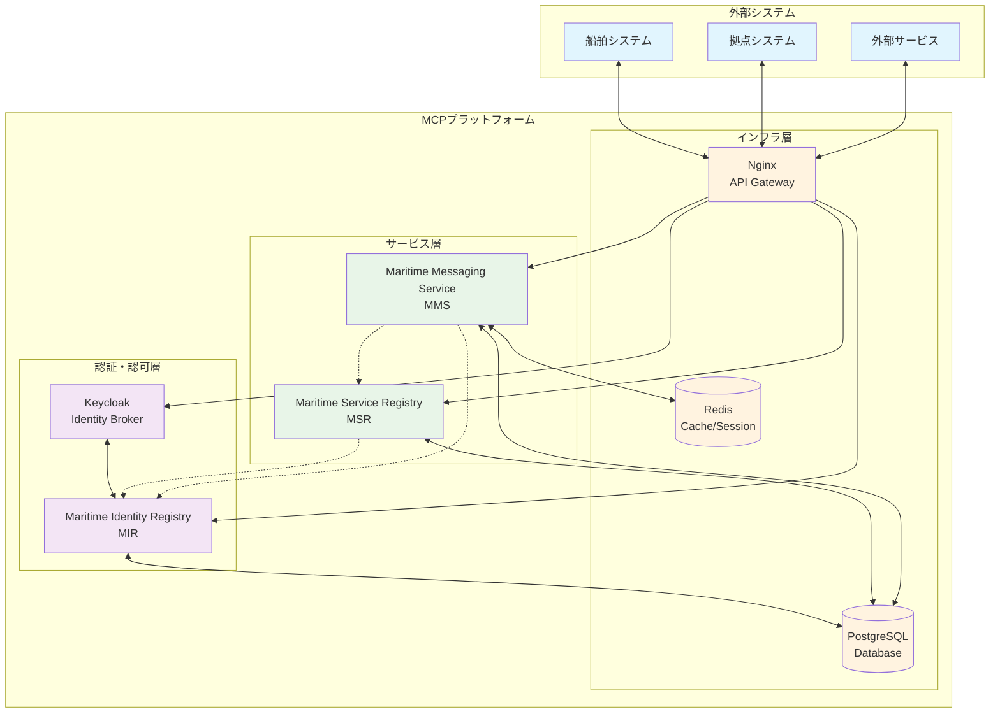
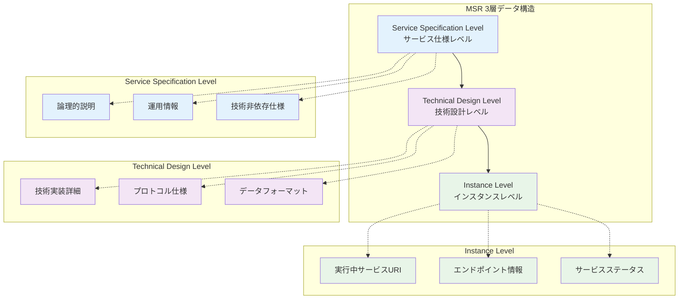
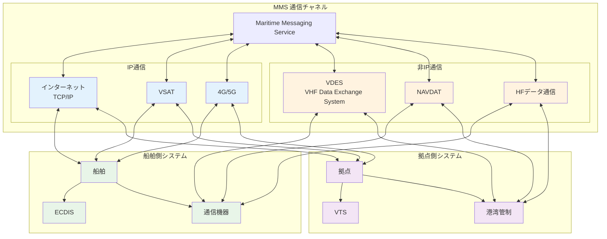

# Maritime Connectivity Platform (MCP) 技術仕様

## アーキテクチャ概要

MCPはサービス指向アーキテクチャ（SOA）として設計されており、マイクロサービスアプローチを採用しています。各コンポーネントは独立して開発、デプロイ、スケーリングが可能です。



## 技術スタック

### プロトコルと標準
- **認証**: OAUTH 2.0 / OpenID Connect
- **API**: RESTful API（HTTP/HTTPS）
- **API仕様**: OpenAPI (Swagger)
- **データ形式**: JSON, XML
- **地理空間データ**: Well Known Text (WKT) format

## コンポーネント別技術仕様

### 1. Maritime Identity Registry (MIR)

#### 認証メカニズム
- **標準**: OAUTH 2.0, OpenID Connect
- **証明書**: X.509証明書
- **PKI**: 公開鍵インフラストラクチャ

#### アイデンティティ管理
- MRN（Maritime Resource Name）ベースの識別
- 階層的な組織構造のサポート
- ロールベースアクセスコントロール（RBAC）

#### API仕様
```
GET /api/org/{mrn} - 組織情報の取得
POST /api/org - 新規組織の登録
PUT /api/org/{mrn} - 組織情報の更新
DELETE /api/org/{mrn} - 組織の削除
```

### 2. Maritime Service Registry (MSR)

#### データ構造（3層構造）



#### API仕様
```
# サービス仕様API
GET /api/serviceSpecifications - 全サービス仕様の取得
POST /api/serviceSpecifications - 新規サービス仕様の登録
GET /api/serviceSpecifications/{id} - 特定のサービス仕様の取得

# サービスインスタンスAPI
GET /api/serviceInstances - 全サービスインスタンスの取得
POST /api/serviceInstances - 新規サービスインスタンスの登録
GET /api/serviceInstances/{id} - 特定のサービスインスタンスの取得
```

#### サービス検索
- キーワード検索
- 地理的範囲検索（WKT形式）
- 組織別検索
- サービスタイプ別検索

#### API アクセス
- **プロトコル**: HTTP/HTTPS
- **認証**: MIRと連携した認証
- **APIドキュメント**: Swagger UI
- **テストベッドURL**: https://msr.maritimeconnectivity.net/swagger-ui/index.html

### 3. Maritime Messaging Service (MMS)

#### アーキテクチャ
- **メッセージブローカー**: 非同期メッセージング
- **プロトコル**: Maritime Message Transfer Protocol (MMTP)
- **標準化**: RTCM Standard 13900.0

#### 通信チャネル



#### メッセージルーティング
- MRNベースのエンドポイントアドレッシング
- 動的ルーティング
- 複数通信パスの自動選択

#### メッセージ形式
```json
{
  "header": {
    "id": "message-uuid",
    "timestamp": "2024-01-01T00:00:00Z",
    "sender": "urn:mrn:mcp:vessel:imo:1234567",
    "receiver": "urn:mrn:mcp:org:mcc:service:vts",
    "subject": "Navigation Update"
  },
  "body": {
    "content": "Base64 encoded content",
    "contentType": "application/json",
    "encryption": "AES-256"
  }
}
```

## セキュリティ仕様

### 暗号化
- **転送時**: TLS 1.2以上
- **保存時**: AES-256暗号化
- **メッセージレベル**: エンドツーエンド暗号化

### 認証と認可
- **多要素認証**: サポート
- **トークンベース認証**: JWT (JSON Web Tokens)
- **APIキー管理**: セキュアな保管と定期的なローテーション

### 監査とログ
- 全APIアクセスのログ記録
- セキュリティイベントの監視
- コンプライアンスレポート機能

## 実装ガイドライン

### 開発環境のセットアップ
1. MCP SDKのインストール
2. 開発用証明書の取得
3. テストベッドへの接続設定

### 統合手順
1. MIRへの組織登録
2. サービス仕様のMSRへの登録
3. サービスインスタンスのデプロイ
4. MMSエンドポイントの設定

### ベストプラクティス
- APIレート制限の実装
- エラーハンドリングの適切な実装
- 接続の再試行ロジック
- キャッシュ戦略の実装

## パフォーマンス要件

### レスポンスタイム
- API応答: < 500ms（95パーセンタイル）
- メッセージ配信: < 2秒（通常条件下）

### スケーラビリティ
- 水平スケーリングのサポート
- ロードバランシング対応
- 高可用性構成

## 互換性

### サポートされるプラットフォーム
- Linux (Ubuntu 20.04+, CentOS 7+)
- Windows Server 2016+
- コンテナ環境 (Docker, Kubernetes)

### 言語別SDK
- Java
- .NET
- Python
- JavaScript/Node.js

## リファレンス

- MCP公式ドキュメント: https://docs.maritimeconnectivity.net/
- APIリファレンス: https://msr.maritimeconnectivity.net/swagger-ui/
- IALA Guidelines: G1128, G1183
- RTCM Standards: 13900.0