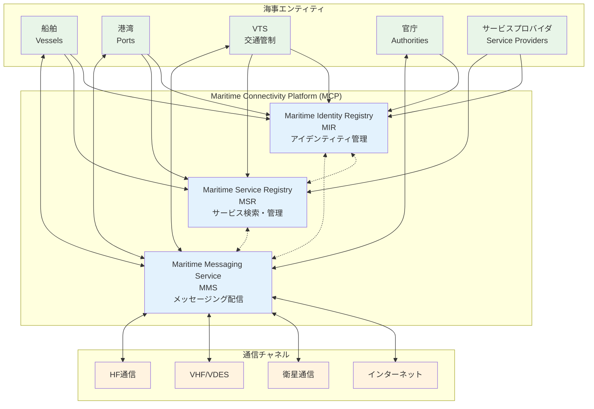

# Maritime Connectivity Platform (MCP) 概要

## MCPとは

Maritime Connectivity Platform（MCP）は、海事分野におけるセキュアで信頼性の高い情報交換を促進するための分散型プラットフォームです。海事業界のデジタルトランスフォーメーションを支援し、標準化されたアイデンティティ管理、サービス検出、および様々な通信チャネルを介した信頼性の高いメッセージングを提供します。

## 主な特徴

### 1. 分散型アーキテクチャ
MCPは分散型プラットフォームとして設計されており、単一の運営主体は存在しません。複数の組織がMCPサービスプロバイダーとして機能し、集合的に「Maritime Connectivity Platform」を形成しています。

### 2. セキュリティ機能
- 海事サイバーセキュリティ（デジタルアイデンティティ管理のインフラストラクチャを含む）
- 双方向メッセージ認証および/または暗号化が可能な唯一の実現可能なソリューション
- OAUTH 2.0 / OpenID Connectなどの確立されたインターネット標準に基づく認証

### 3. 標準準拠
- Maritime Resource Name（MRN）スキームの適用（海事リソースを一意に識別するための標準）
- IALA Guideline 1128に準拠したサービス仕様標準
- RTCMを通じた標準化（特にMMS）

## コアコンポーネント

MCPは3つの主要コンポーネントで構成されています：

### 1. Maritime Identity Registry (MIR)
**目的**: すべての海事関係者の認証を可能にし、通信のセキュリティと信頼性を向上させる

**主な機能**:
- 人間のアクター、サービス、デバイスなどの海事エンティティの信頼できるアイデンティティ認証インフラストラクチャの提供
- OAUTH 2.0 / OpenID Connectに基づく認証インフラストラクチャ
- IALA guideline G1183で定義されたセキュアアイデンティティの要件

### 2. Maritime Service Registry (MSR)
**目的**: サービスの検出と管理を可能にし、サービスプロバイダーがMCPにサービスを登録し、エンドユーザーがそれらのサービスを発見できるようにする

**主な機能**:
- サービス仕様の登録と管理
- キーワード、組織、場所などの様々な基準によるサービス検索
- サービスインスタンスの実行時情報の提供

**構造**:
- **Service Specification**: サービスの論理的な説明
- **Technical Design**: 技術レベルでのサービスの実現
- **Instance**: 実行中のサービスインスタンスに関する情報

### 3. Maritime Messaging Service (MMS)
**目的**: Maritime Resource Name（MRN）をエンドポイントアドレスとして使用し、IPおよび非IP通信チャネルの両方を介してメッセージを配信する

**主な機能**:
- 様々な通信技術（VDES、NAVDAT、インターネット）の利用
- 不安定で予測不可能な海事環境での信頼性の高いメッセージング
- RTCM Standard 13900.0で定義されたアーキテクチャとプロトコル

**使用例**:
INMARSATアクセスを使用して特定の船舶から送信されたメッセージは、別の船舶のVSAT端末、さらに別の船舶のHFデータ接続、またはDSL固定インターネット接続のVTSオペレーターによって受信される可能性があります。

## ガバナンス

MCP Consortium（MCC）がMCPに関連する標準のガバナンスを行っています。MCCの役割：
- MCPに関連する標準の管理
- MCPリファレンスソースコードの管理
- 他の組織がMCPの運用インスタンスを実行することの承認

## 実装リソース

- 公式ドキュメント: docs.maritimeconnectivity.net
- MCCテストベッド: https://msr.maritimeconnectivity.net/
- IALAによるテスト用MCPインスタンス（KRISOとGLAが運営）

## まとめ

MCPは、海事環境でのセキュアなデジタルサービスを可能にし、海事セクター内外での効率的、安全、かつ信頼性の高い情報交換を実現するフレームワークを提供します。すべての海事関係者をあらゆる種類の海事情報サービスと接続し、海事業界のデジタル化を促進します。