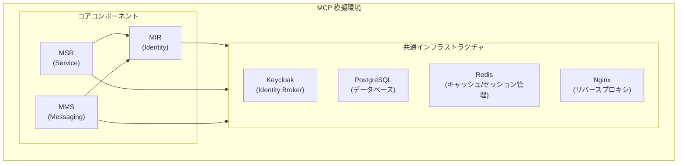

# MCP模擬環境構築ガイド

## 概要

このガイドでは、Maritime Connectivity Platform (MCP)の模擬環境を構築するために必要な知識と手順を説明します。MCPは分散型プラットフォームであり、以下の3つのコアコンポーネントで構成されています：

1. **Maritime Identity Registry (MIR)** - 認証・認可を管理
2. **Maritime Service Registry (MSR)** - サービスの登録・検出を管理
3. **Maritime Messaging Service (MMS)** - メッセージングを管理

## 前提条件

### 必要な技術スキル
- Docker/Docker Composeの基本的な知識
- OAuth 2.0/OpenID Connectの理解
- RESTful APIの設計と実装経験
- PKI（公開鍵インフラストラクチャ）の基礎知識
- Java、Node.js、またはPythonのいずれかの開発経験

### システム要件
- Docker Engine 20.10以上
- Docker Compose 2.0以上
- 最小8GB RAM（推奨16GB）
- 20GB以上の空きディスク容量
- インターネット接続

## 模擬環境のアーキテクチャ

## 主要コンポーネントの技術仕様

### 1. Maritime Identity Registry (MIR)

#### 技術スタック
- **認証基盤**: Keycloak（Identity Broker）
- **プロトコル**: OAuth 2.0, OpenID Connect
- **証明書管理**: X.509証明書、PKI
- **データストア**: PostgreSQL

#### 必要な設定
- OpenID Connectプロバイダーの設定
- 証明書発行機関（CA）の設定
- MRN（Maritime Resource Name）の管理体系

### 2. Maritime Service Registry (MSR)

#### 技術スタック
- **APIフレームワーク**: Spring Boot（Java）またはExpress（Node.js）
- **API仕様**: OpenAPI (Swagger)
- **データストア**: PostgreSQL
- **検索エンジン**: Elasticsearch（オプション）

#### 必要な設定
- サービス仕様のスキーマ定義
- 地理空間データ（WKT形式）のサポート
- MIRとの連携設定

### 3. Maritime Messaging Service (MMS)

#### 技術スタック
- **メッセージブローカー**: Apache Kafka または RabbitMQ
- **プロトコル**: MMTP (Maritime Message Transfer Protocol)
- **ルーティング**: 動的ルーティングエンジン
- **データストア**: Redis（セッション管理）

#### 必要な設定
- MRNベースのルーティング設定
- 複数通信チャネルのシミュレーション
- メッセージ暗号化の設定

## 環境構築の手順

### ステップ1: 基盤となるインフラの準備

1. **Keycloakのセットアップ**
   - Identity Brokerとして機能
   - 複数のIdentity Providerをサポート
   - MCP用のレルムとクライアントを設定

2. **データベースの準備**
   - PostgreSQL 13以上を使用
   - 各コンポーネント用のデータベースを作成
   - 接続プールとバックアップの設定

3. **リバースプロキシの設定**
   - Nginxで統一エンドポイントを提供
   - SSL/TLS終端処理
   - ロードバランシング（必要に応じて）

### ステップ2: 各コンポーネントの実装

1. **MIR実装の要点**
   - Keycloakとの統合
   - 証明書の発行・管理API
   - 組織階層の管理

2. **MSR実装の要点**
   - サービス仕様の登録API
   - サービス検索機能
   - サービスインスタンスの管理

3. **MMS実装の要点**
   - メッセージルーティングロジック
   - 通信チャネルのシミュレーション
   - メッセージの永続化と配信保証

### ステップ3: 統合とテスト

1. **統合テスト**
   - エンドツーエンドのシナリオテスト
   - セキュリティテスト
   - パフォーマンステスト

2. **監視とログ**
   - Prometheus/Grafanaによる監視
   - 集中ログ管理（ELKスタック）
   - トレーシング（Jaeger）

## セキュリティ考慮事項

### 認証・認可
- OAuth 2.0フローの適切な実装
- JWTトークンの検証
- ロールベースアクセス制御（RBAC）

### 通信セキュリティ
- TLS 1.2以上の使用
- 証明書のピンニング
- メッセージレベルの暗号化

### データ保護
- 保存時の暗号化
- 個人情報の適切な管理
- 監査ログの保持

## 開発のベストプラクティス

### 設計原則
- マイクロサービスアーキテクチャ
- APIファーストアプローチ
- 疎結合な設計

### 実装のポイント
- 既存のOSSを活用（車輪の再発明を避ける）
- 標準規格への準拠
- 水平スケーリングを考慮した設計

### テスト戦略
- ユニットテストの充実
- 統合テストの自動化
- カオスエンジニアリング（オプション）

## トラブルシューティング

### よくある問題と解決方法

1. **認証の問題**
   - Keycloakのレルム設定を確認
   - クライアント設定の検証
   - トークンの有効期限を確認

2. **サービス検出の問題**
   - MSRのエンドポイント設定を確認
   - サービスインスタンスの登録状態を確認
   - ネットワーク接続性を確認

3. **メッセージング配信の問題**
   - メッセージブローカーの状態を確認
   - ルーティング設定を検証
   - キューのサイズと設定を確認

## 参考リソース

### 公式ドキュメント
- MCP公式サイト: https://maritimeconnectivity.net/
- MCP技術文書: https://docs.maritimeconnectivity.net/
- GitHubリポジトリ: https://github.com/maritimeconnectivity/

### 関連技術
- Keycloak: https://www.keycloak.org/
- OpenID Connect: https://openid.net/connect/
- Docker: https://docs.docker.com/

### 標準規格
- IALA Guideline G1128（サービス仕様）
- IALA Guideline G1183（セキュアアイデンティティ）
- RTCM Standard 13900.0（MMS）

## 注意事項

- この模擬環境は開発・テスト用途のみを想定しています
- 本番環境での使用は推奨されません
- MCPテストベッドを利用する場合は、運用サービスの登録は禁止されています
- 実際の運用にはMCP Instance Providerの利用を検討してください