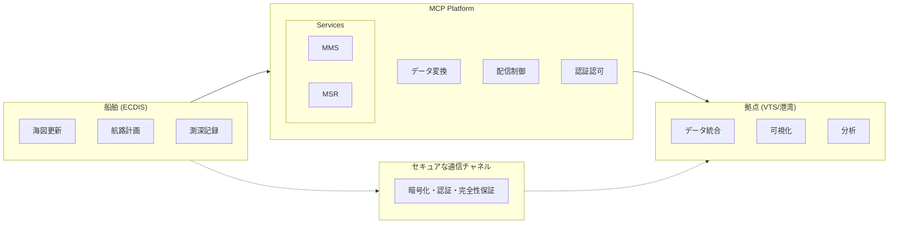

# MCP海図データ送受信ガイド

## 概要

このドキュメントでは、Maritime Connectivity Platform (MCP) における船舶から拠点への海図データ（Chart Data）の送受信について説明します。海図データには、航路情報、水深データ、障害物情報、気象海象データなどが含まれ、安全な航行に不可欠な情報です。

## 海図データの種類と標準

### 1. 電子海図データ標準

#### S-57 (IHO Transfer Standard)
- **形式**: ベクトルデータ
- **用途**: 公式電子海図（ENC）
- **内容**: 海岸線、水深、航路標識、危険物

#### S-100 (Universal Hydrographic Data Model)
- **形式**: XML/GMLベース
- **用途**: 次世代海図データ
- **拡張性**: プラグイン可能なデータモデル

#### S-101 (Electronic Navigational Chart)
- **形式**: S-100準拠のENC
- **特徴**: 動的な潮汐データ、時系列情報

### 2. MCPで扱う海図関連データ

```
1. 航路計画データ (Route Plan)
2. 水深・測深データ (Bathymetric Data)
3. 航行警報区域 (Navigational Warnings)
4. 気象海象データ (Metocean Data)
5. AIS航跡データ (AIS Track Data)
6. 港湾施設情報 (Port Facility Data)
```

## システムアーキテクチャ



## 海図データ送受信の実装

### 1. データ構造定義

#### 航路計画データ
```python
from pydantic import BaseModel, Field
from typing import List, Optional, Dict
from datetime import datetime

class Waypoint(BaseModel):
    """航路上の通過点"""
    sequence_number: int
    latitude: float = Field(..., ge=-90, le=90)
    longitude: float = Field(..., ge=-180, le=180)
    planned_speed: float = Field(..., gt=0)  # knots
    planned_eta: datetime
    turn_radius: Optional[float] = None  # nautical miles
    notes: Optional[str] = None

class RoutePlan(BaseModel):
    """航路計画"""
    route_id: str
    vessel_mrn: str
    route_name: str
    departure_port: str
    arrival_port: str
    planned_etd: datetime
    planned_eta: datetime
    waypoints: List[Waypoint]
    route_status: str = "planned"  # planned, active, completed
    optimization_criteria: str = "shortest"  # shortest, safest, economical
    metadata: Optional[Dict] = None

class RouteExchange(BaseModel):
    """航路交換フォーマット（RTZ準拠）"""
    version: str = "1.1"
    route: RoutePlan
    extensions: Optional[Dict] = None
```

#### 水深データ
```python
class BathymetricPoint(BaseModel):
    """測深点データ"""
    latitude: float
    longitude: float
    depth: float  # meters
    timestamp: datetime
    quality_indicator: int = Field(..., ge=1, le=5)  # 1=最高品質
    measurement_method: str  # single-beam, multi-beam, lidar

class BathymetricDataset(BaseModel):
    """測深データセット"""
    dataset_id: str
    vessel_mrn: str
    survey_area: Dict[str, float]  # bbox: min_lat, max_lat, min_lon, max_lon
    start_time: datetime
    end_time: datetime
    points: List[BathymetricPoint]
    coordinate_system: str = "WGS84"
    vertical_datum: str = "MSL"  # Mean Sea Level
    metadata: Optional[Dict] = None
```

#### 航行警報データ
```python
class NavigationalWarning(BaseModel):
    """航行警報"""
    warning_id: str
    warning_type: str  # obstruction, restricted_area, weather, military_exercise
    severity: str  # critical, major, minor
    area_wkt: str  # Well-Known Text format for geometry
    valid_from: datetime
    valid_to: Optional[datetime]
    description: str
    issued_by: str
    metadata: Optional[Dict] = None
```

### 2. 海図データの送信実装

#### 大容量データの分割送信
```python
import asyncio
import aiohttp
import hashlib
import json
from typing import BinaryIO, AsyncIterator

class ChartDataTransmitter:
    def __init__(self, mcp_base_url: str, vessel_mrn: str):
        self.mcp_base_url = mcp_base_url
        self.vessel_mrn = vessel_mrn
        self.chunk_size = 1024 * 1024  # 1MB chunks
        
    async def upload_large_chart_data(self, file_path: str, 
                                    recipient_mrn: str, 
                                    data_type: str) -> str:
        """大容量海図データのアップロード"""
        file_info = await self._prepare_upload(file_path, data_type)
        
        # マルチパートアップロードの初期化
        upload_session = await self._initiate_multipart_upload(
            recipient_mrn, file_info
        )
        
        # チャンク単位でアップロード
        async with aiofiles.open(file_path, 'rb') as f:
            chunk_number = 0
            while True:
                chunk = await f.read(self.chunk_size)
                if not chunk:
                    break
                
                await self._upload_chunk(
                    upload_session['session_id'],
                    chunk_number,
                    chunk
                )
                chunk_number += 1
        
        # アップロード完了
        return await self._complete_upload(upload_session['session_id'])
    
    async def _prepare_upload(self, file_path: str, data_type: str) -> Dict:
        """アップロード準備"""
        file_size = os.path.getsize(file_path)
        file_hash = await self._calculate_file_hash(file_path)
        
        return {
            'file_name': os.path.basename(file_path),
            'file_size': file_size,
            'file_hash': file_hash,
            'data_type': data_type,
            'chunks': (file_size + self.chunk_size - 1) // self.chunk_size
        }
    
    async def _calculate_file_hash(self, file_path: str) -> str:
        """ファイルのSHA256ハッシュを計算"""
        sha256_hash = hashlib.sha256()
        async with aiofiles.open(file_path, 'rb') as f:
            while chunk := await f.read(8192):
                sha256_hash.update(chunk)
        return sha256_hash.hexdigest()
```

#### 航路計画の送信
```python
class RouteExchangeService:
    def __init__(self, mms_client):
        self.mms_client = mms_client
        
    async def send_route_plan(self, route_plan: RoutePlan, 
                            recipient_mrn: str) -> bool:
        """航路計画を送信"""
        # RTZ形式に変換
        rtz_data = self._convert_to_rtz(route_plan)
        
        # メッセージとして送信
        message = {
            "recipient_mrn": recipient_mrn,
            "message_type": "route_exchange",
            "subject": f"Route Plan: {route_plan.route_name}",
            "body": "航路計画データを送信します",
            "attachments": [{
                "filename": f"{route_plan.route_id}.rtz",
                "content_type": "application/x-rtz",
                "data": rtz_data
            }],
            "metadata": {
                "route_id": route_plan.route_id,
                "departure_port": route_plan.departure_port,
                "arrival_port": route_plan.arrival_port,
                "etd": route_plan.planned_etd.isoformat(),
                "eta": route_plan.planned_eta.isoformat()
            }
        }
        
        return await self.mms_client.send_message(message)
    
    def _convert_to_rtz(self, route_plan: RoutePlan) -> str:
        """航路計画をRTZ形式に変換"""
        rtz_template = """<?xml version="1.0" encoding="UTF-8"?>
<route version="1.1" xmlns="http://www.cirm.org/RTZ/1/1">
    <routeInfo routeName="{route_name}" routeStatus="{status}">
        <extensions>
            <extension name="mcp_route_id" value="{route_id}"/>
            <extension name="vessel_mrn" value="{vessel_mrn}"/>
        </extensions>
    </routeInfo>
    <waypoints>
        {waypoints}
    </waypoints>
    <schedules>
        <schedule id="1" name="Default">
            <calculated>
                {schedule_elements}
            </calculated>
        </schedule>
    </schedules>
</route>"""
        
        waypoints_xml = self._generate_waypoints_xml(route_plan.waypoints)
        schedule_xml = self._generate_schedule_xml(route_plan.waypoints)
        
        return rtz_template.format(
            route_name=route_plan.route_name,
            status=route_plan.route_status,
            route_id=route_plan.route_id,
            vessel_mrn=route_plan.vessel_mrn,
            waypoints=waypoints_xml,
            schedule_elements=schedule_xml
        )
```

#### 測深データのストリーミング送信
```python
class BathymetricDataStreamer:
    def __init__(self, websocket_url: str):
        self.ws_url = websocket_url
        self.buffer = []
        self.buffer_size = 100  # points
        
    async def stream_bathymetric_data(self, vessel_mrn: str, 
                                     recipient_mrn: str):
        """リアルタイム測深データのストリーミング"""
        async with websockets.connect(f"{self.ws_url}/{vessel_mrn}") as ws:
            sounder = EchoSounder()  # 測深機インターフェース
            
            async for depth_reading in sounder.read_continuous():
                point = BathymetricPoint(
                    latitude=depth_reading.latitude,
                    longitude=depth_reading.longitude,
                    depth=depth_reading.depth,
                    timestamp=datetime.now(),
                    quality_indicator=depth_reading.quality,
                    measurement_method="single-beam"
                )
                
                self.buffer.append(point)
                
                # バッファがいっぱいになったら送信
                if len(self.buffer) >= self.buffer_size:
                    await self._send_buffer(ws, recipient_mrn)
    
    async def _send_buffer(self, ws, recipient_mrn: str):
        """バッファ内のデータを送信"""
        if not self.buffer:
            return
            
        message = {
            "recipient_mrn": recipient_mrn,
            "message_type": "bathymetric_stream",
            "data": [point.dict() for point in self.buffer],
            "timestamp": datetime.now().isoformat()
        }
        
        await ws.send(json.dumps(message))
        self.buffer.clear()
```

### 3. 海図データの受信実装

#### 拠点側のデータ受信・処理
```python
class ChartDataReceiver:
    def __init__(self, storage_path: str):
        self.storage_path = storage_path
        self.active_sessions = {}
        
    async def handle_chart_data_message(self, message: Dict):
        """海図データメッセージの処理"""
        message_type = message.get('message_type')
        
        if message_type == 'route_exchange':
            return await self._handle_route_exchange(message)
        elif message_type == 'bathymetric_stream':
            return await self._handle_bathymetric_stream(message)
        elif message_type == 'chart_update':
            return await self._handle_chart_update(message)
        elif message_type == 'navigational_warning':
            return await self._handle_nav_warning(message)
    
    async def _handle_route_exchange(self, message: Dict):
        """航路交換データの処理"""
        attachments = message.get('attachments', [])
        
        for attachment in attachments:
            if attachment['content_type'] == 'application/x-rtz':
                # RTZファイルを保存
                file_path = await self._save_attachment(
                    attachment,
                    message['sender_mrn']
                )
                
                # 航路データを解析
                route_data = await self._parse_rtz_file(file_path)
                
                # データベースに保存
                await self._store_route_plan(route_data)
                
                # 可視化システムに通知
                await self._notify_visualization_system(
                    'new_route',
                    route_data
                )
    
    async def _handle_bathymetric_stream(self, message: Dict):
        """測深ストリームデータの処理"""
        points = message.get('data', [])
        sender_mrn = message['sender_mrn']
        
        # データ品質チェック
        validated_points = await self._validate_bathymetric_data(points)
        
        # 時系列データベースに保存
        await self._store_bathymetric_points(
            sender_mrn,
            validated_points
        )
        
        # リアルタイム処理
        await self._process_realtime_depths(validated_points)
```

#### データ統合・可視化
```python
class ChartDataIntegrator:
    def __init__(self, gis_engine):
        self.gis_engine = gis_engine
        self.data_layers = {}
        
    async def integrate_chart_data(self, data_type: str, data: Any):
        """異なるソースからの海図データを統合"""
        if data_type == 'route_plan':
            layer = await self._create_route_layer(data)
        elif data_type == 'bathymetric':
            layer = await self._create_bathymetric_layer(data)
        elif data_type == 'nav_warning':
            layer = await self._create_warning_layer(data)
        
        # GISエンジンにレイヤーを追加
        layer_id = await self.gis_engine.add_layer(layer)
        self.data_layers[layer_id] = layer
        
        return layer_id
    
    async def _create_bathymetric_layer(self, points: List[BathymetricPoint]):
        """測深データから等深線レイヤーを作成"""
        # ポイントデータから補間
        grid = await self._interpolate_depths(points)
        
        # 等深線を生成
        contours = await self._generate_contours(grid, intervals=[5, 10, 20, 50])
        
        # GeoJSONレイヤーとして返す
        return {
            "type": "FeatureCollection",
            "features": contours,
            "properties": {
                "layer_type": "bathymetric_contours",
                "timestamp": datetime.now().isoformat(),
                "source_points": len(points)
            }
        }
```

### 4. セキュリティとデータ整合性

#### データ署名と検証
```python
import cryptography
from cryptography.hazmat.primitives import hashes, serialization
from cryptography.hazmat.primitives.asymmetric import padding, rsa

class ChartDataSecurity:
    def __init__(self, private_key_path: str, public_keys_dir: str):
        self.private_key = self._load_private_key(private_key_path)
        self.public_keys = self._load_public_keys(public_keys_dir)
    
    def sign_chart_data(self, data: bytes) -> bytes:
        """海図データに電子署名を付与"""
        signature = self.private_key.sign(
            data,
            padding.PSS(
                mgf=padding.MGF1(hashes.SHA256()),
                salt_length=padding.PSS.MAX_LENGTH
            ),
            hashes.SHA256()
        )
        return signature
    
    def verify_chart_data(self, data: bytes, signature: bytes, 
                         sender_mrn: str) -> bool:
        """海図データの署名を検証"""
        public_key = self.public_keys.get(sender_mrn)
        if not public_key:
            return False
            
        try:
            public_key.verify(
                signature,
                data,
                padding.PSS(
                    mgf=padding.MGF1(hashes.SHA256()),
                    salt_length=padding.PSS.MAX_LENGTH
                ),
                hashes.SHA256()
            )
            return True
        except Exception:
            return False
```

#### データ圧縮と暗号化
```python
import zlib
import base64
from cryptography.fernet import Fernet

class ChartDataCompression:
    @staticmethod
    def compress_chart_data(data: bytes) -> bytes:
        """海図データを圧縮"""
        return zlib.compress(data, level=9)
    
    @staticmethod
    def decompress_chart_data(compressed: bytes) -> bytes:
        """圧縮された海図データを展開"""
        return zlib.decompress(compressed)
    
    @staticmethod
    def encrypt_sensitive_data(data: bytes, key: bytes) -> bytes:
        """機密性の高い海図データを暗号化"""
        f = Fernet(key)
        return f.encrypt(data)
```

## 海図データ交換のベストプラクティス

### 1. データ品質管理
```python
class ChartDataQualityControl:
    def __init__(self):
        self.quality_thresholds = {
            'position_accuracy': 10.0,  # meters
            'depth_accuracy': 0.5,      # meters
            'time_sync_tolerance': 1.0  # seconds
        }
    
    async def validate_route_plan(self, route: RoutePlan) -> ValidationResult:
        """航路計画の妥当性チェック"""
        issues = []
        
        # 航路点の連続性チェック
        for i in range(1, len(route.waypoints)):
            distance = self._calculate_distance(
                route.waypoints[i-1],
                route.waypoints[i]
            )
            time_diff = (route.waypoints[i].planned_eta - 
                        route.waypoints[i-1].planned_eta).total_seconds() / 3600
            
            required_speed = distance / time_diff
            if required_speed > 30:  # 30ノット以上は異常
                issues.append(f"Unrealistic speed between WP{i-1} and WP{i}")
        
        # 水深チェック（既存海図データと照合）
        for wp in route.waypoints:
            depth = await self._check_depth_at_position(wp.latitude, wp.longitude)
            if depth < 10:  # 10m以下は警告
                issues.append(f"Shallow water warning at WP{wp.sequence_number}")
        
        return ValidationResult(valid=len(issues)==0, issues=issues)
```

### 2. 差分更新の実装
```python
class ChartDifferentialUpdate:
    def __init__(self):
        self.update_cache = {}
    
    def create_differential_update(self, 
                                 old_chart: ChartData, 
                                 new_chart: ChartData) -> DifferentialUpdate:
        """差分更新データの作成"""
        changes = {
            'added_features': [],
            'modified_features': [],
            'deleted_features': []
        }
        
        # 特徴の比較
        old_features = {f.id: f for f in old_chart.features}
        new_features = {f.id: f for f in new_chart.features}
        
        # 追加された特徴
        for fid, feature in new_features.items():
            if fid not in old_features:
                changes['added_features'].append(feature)
        
        # 変更された特徴
        for fid, feature in new_features.items():
            if fid in old_features and feature != old_features[fid]:
                changes['modified_features'].append({
                    'id': fid,
                    'changes': self._compute_changes(old_features[fid], feature)
                })
        
        # 削除された特徴
        for fid in old_features:
            if fid not in new_features:
                changes['deleted_features'].append(fid)
        
        return DifferentialUpdate(
            base_version=old_chart.version,
            target_version=new_chart.version,
            changes=changes,
            timestamp=datetime.now()
        )
```

### 3. リアルタイム同期
```python
class ChartDataSynchronizer:
    def __init__(self, sync_interval: int = 300):  # 5分
        self.sync_interval = sync_interval
        self.sync_queue = asyncio.Queue()
        
    async def start_sync_service(self):
        """同期サービスの開始"""
        tasks = [
            asyncio.create_task(self._sync_worker()),
            asyncio.create_task(self._monitor_changes())
        ]
        await asyncio.gather(*tasks)
    
    async def _monitor_changes(self):
        """ローカル変更の監視"""
        async for change_event in self.watch_chart_changes():
            await self.sync_queue.put(change_event)
    
    async def _sync_worker(self):
        """同期ワーカー"""
        while True:
            try:
                # バッチ処理のため複数の変更をまとめる
                changes = []
                deadline = asyncio.get_event_loop().time() + 1.0
                
                while asyncio.get_event_loop().time() < deadline:
                    try:
                        change = await asyncio.wait_for(
                            self.sync_queue.get(),
                            timeout=deadline - asyncio.get_event_loop().time()
                        )
                        changes.append(change)
                    except asyncio.TimeoutError:
                        break
                
                if changes:
                    await self._sync_changes_batch(changes)
                    
            except Exception as e:
                logger.error(f"Sync error: {e}")
                await asyncio.sleep(5)
```

## パフォーマンス最適化

### 1. データのタイリング
```python
class ChartDataTiling:
    def __init__(self, tile_size: int = 256):
        self.tile_size = tile_size
        self.tile_cache = LRUCache(maxsize=1000)
    
    def create_tiles(self, chart_data: ChartData, zoom_levels: List[int]):
        """海図データをタイル化"""
        tiles = {}
        
        for zoom in zoom_levels:
            scale = 2 ** zoom
            tiles[zoom] = {}
            
            # タイル座標の計算
            bounds = chart_data.get_bounds()
            x_min = int(bounds.west * scale / 360)
            x_max = int(bounds.east * scale / 360)
            y_min = int((90 - bounds.north) * scale / 180)
            y_max = int((90 - bounds.south) * scale / 180)
            
            for x in range(x_min, x_max + 1):
                tiles[zoom][x] = {}
                for y in range(y_min, y_max + 1):
                    tile_data = self._extract_tile_data(
                        chart_data, x, y, zoom
                    )
                    if tile_data:
                        tiles[zoom][x][y] = self._compress_tile(tile_data)
        
        return tiles
```

### 2. キャッシング戦略
```python
class ChartDataCache:
    def __init__(self, redis_client):
        self.redis = redis_client
        self.local_cache = {}
        
    async def get_chart_data(self, area_id: str, version: str = None):
        """キャッシュから海図データを取得"""
        cache_key = f"chart:{area_id}:{version or 'latest'}"
        
        # ローカルキャッシュをチェック
        if cache_key in self.local_cache:
            return self.local_cache[cache_key]
        
        # Redisキャッシュをチェック
        cached_data = await self.redis.get(cache_key)
        if cached_data:
            data = json.loads(cached_data)
            self.local_cache[cache_key] = data
            return data
        
        return None
    
    async def set_chart_data(self, area_id: str, version: str, 
                           data: Dict, ttl: int = 3600):
        """海図データをキャッシュに保存"""
        cache_key = f"chart:{area_id}:{version}"
        
        # Redisに保存
        await self.redis.setex(
            cache_key,
            ttl,
            json.dumps(data)
        )
        
        # ローカルキャッシュも更新
        self.local_cache[cache_key] = data
```

## 実装例とユースケース

### 1. 自動航路最適化システム
```python
class AutoRouteOptimizer:
    def __init__(self, chart_service, weather_service):
        self.chart_service = chart_service
        self.weather_service = weather_service
    
    async def optimize_route(self, 
                           departure: Dict, 
                           arrival: Dict,
                           vessel_specs: Dict) -> RoutePlan:
        """最適航路の自動生成"""
        # 最新の海図データを取得
        chart_data = await self.chart_service.get_area_charts(
            self._calculate_bounds(departure, arrival)
        )
        
        # 気象データを取得
        weather_data = await self.weather_service.get_forecast(
            area=chart_data.bounds,
            duration_hours=72
        )
        
        # 制約条件の設定
        constraints = {
            'min_depth': vessel_specs['draft'] + 2.0,  # 安全余裕
            'max_wave_height': vessel_specs['max_sea_state'],
            'avoid_areas': await self._get_restricted_areas(chart_data)
        }
        
        # 最適化アルゴリズムの実行
        optimal_route = await self._run_optimization(
            departure, arrival, chart_data, weather_data, constraints
        )
        
        return optimal_route
```

### 2. クラウドソーシング測深データ
```python
class CrowdsourcedBathymetry:
    def __init__(self, data_aggregator):
        self.aggregator = data_aggregator
        self.quality_threshold = 0.8
    
    async def process_crowdsourced_depths(self, vessel_mrn: str, 
                                        depth_data: List[BathymetricPoint]):
        """クラウドソース測深データの処理"""
        # データ品質評価
        quality_score = await self._assess_data_quality(vessel_mrn, depth_data)
        
        if quality_score < self.quality_threshold:
            return {"status": "rejected", "reason": "quality_below_threshold"}
        
        # 既存データとの整合性チェック
        conflicts = await self._check_consistency(depth_data)
        
        if conflicts:
            # 統計的手法で調整
            adjusted_data = await self._resolve_conflicts(depth_data, conflicts)
        else:
            adjusted_data = depth_data
        
        # 集約データベースに追加
        result = await self.aggregator.add_bathymetric_data(
            source=vessel_mrn,
            data=adjusted_data,
            quality_score=quality_score
        )
        
        # 貢献者へのインセンティブ計算
        incentive = self._calculate_incentive(len(adjusted_data), quality_score)
        
        return {
            "status": "accepted",
            "processed_points": len(adjusted_data),
            "incentive_earned": incentive
        }
```

## トラブルシューティング

### よくある問題と解決方法

1. **大容量データの転送タイムアウト**
```python
# チャンクサイズの調整
transmitter.chunk_size = 512 * 1024  # 512KB
# 再送信メカニズムの実装
async def upload_with_retry(data, max_retries=3):
    for attempt in range(max_retries):
        try:
            return await upload_data(data)
        except TimeoutError:
            if attempt == max_retries - 1:
                raise
            await asyncio.sleep(2 ** attempt)
```

2. **データフォーマット互換性**
```python
# フォーマット変換ユーティリティ
class ChartFormatConverter:
    @staticmethod
    def s57_to_s101(s57_data):
        # S-57からS-101への変換ロジック
        pass
    
    @staticmethod
    def detect_format(data):
        # データフォーマットの自動検出
        pass
```

3. **同期の競合解決**
```python
# 楽観的ロックによる競合解決
async def update_chart_with_conflict_resolution(chart_id, updates):
    while True:
        current = await get_chart(chart_id)
        new_version = apply_updates(current, updates)
        
        try:
            await save_chart(chart_id, new_version, 
                           expected_version=current.version)
            break
        except VersionConflictError:
            # 再試行
            await asyncio.sleep(0.1)
```

## まとめ

MCPにおける海図データの送受信は、海事業界のデジタル化において重要な要素です。適切な実装により、以下が実現できます：

1. **リアルタイム性**: 最新の海図情報の即時共有
2. **相互運用性**: 標準フォーマットによるシームレスな連携
3. **セキュリティ**: 暗号化と署名による安全なデータ交換
4. **効率性**: 差分更新とキャッシングによる帯域幅の最適化
5. **信頼性**: 品質管理と検証による正確なデータの維持

これらの技術により、より安全で効率的な海上交通が実現されます。