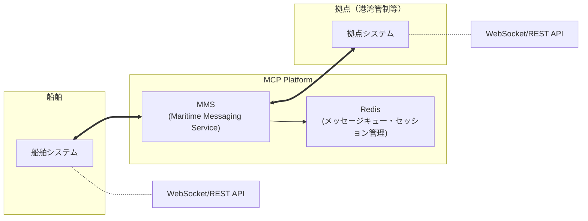

# MCP船舶メッセージング実装ガイド

## 概要

このドキュメントでは、Maritime Connectivity Platform (MCP) における船舶から拠点へのメッセージ送受信の流れを詳しく説明します。MCPのMMS (Maritime Messaging Service) を使用した実際の実装例とAPIの使用方法を示します。

## アーキテクチャ概要



### 主要コンポーネント

- **MMS (Maritime Messaging Service)**: メッセージ配信の中心的役割
- **Redis**: メッセージキューイング、セッション管理、リアルタイム通信
- **WebSocket**: 双方向リアルタイム通信
- **REST API**: メッセージ送信、履歴確認

## MRN (Maritime Resource Name) の理解

### 船舶のMRN例
```
urn:mrn:mcp:vessel:imo:1234567    # IMO番号ベース
urn:mrn:mcp:vessel:mmsi:987654321 # MMSI番号ベース
```

### 拠点のMRN例
```
urn:mrn:mcp:shore:authority:vts:tokyo-bay     # 東京湾VTS
urn:mrn:mcp:shore:port:yokohama               # 横浜港管制
urn:mrn:mcp:shore:pilot:tokyo                 # 東京水先区
```

## メッセージ送受信の実装

### 1. WebSocket接続の確立

#### 船舶側の接続
```javascript
// 船舶（IMO:1234567）の接続
const vesselMrn = 'urn:mrn:mcp:vessel:imo:1234567';
const ws = new WebSocket(`ws://localhost:8083/ws/${encodeURIComponent(vesselMrn)}`);

ws.onopen = function(event) {
    console.log('船舶がMMSに接続しました');
    
    // 接続通知の送信
    ws.send(JSON.stringify({
        type: 'connection_status',
        status: 'connected',
        position: {
            latitude: 35.6762,
            longitude: 139.6503
        },
        timestamp: new Date().toISOString()
    }));
};

ws.onmessage = function(event) {
    const message = JSON.parse(event.data);
    console.log('受信メッセージ:', message);
    
    // メッセージタイプ別の処理
    switch(message.message_type) {
        case 'navigation_instruction':
            handleNavigationInstruction(message);
            break;
        case 'port_clearance':
            handlePortClearance(message);
            break;
        case 'weather_alert':
            handleWeatherAlert(message);
            break;
        default:
            console.log('一般メッセージ:', message.body);
    }
};
```

#### 拠点側の接続
```javascript
// VTS（東京湾管制）の接続
const vtsMrn = 'urn:mrn:mcp:shore:authority:vts:tokyo-bay';
const vtsWs = new WebSocket(`ws://localhost:8083/ws/${encodeURIComponent(vtsMrn)}`);

vtsWs.onopen = function(event) {
    console.log('VTSがMMSに接続しました');
};

vtsWs.onmessage = function(event) {
    const message = JSON.parse(event.data);
    console.log('船舶からのメッセージ:', message);
    
    // 自動応答の例
    if (message.message_type === 'position_report') {
        // 位置報告に対する確認応答
        vtsWs.send(JSON.stringify({
            recipient_mrn: message.sender_mrn,
            message_type: 'acknowledgment',
            subject: 'Position Report Received',
            body: `位置報告を受信しました。現在位置: ${message.body}`,
            reference_message_id: message.message_id
        }));
    }
};
```

### 2. 船舶から拠点へのメッセージ送信

#### 位置報告の送信
```javascript
function sendPositionReport(ws, currentPosition) {
    const message = {
        recipient_mrn: 'urn:mrn:mcp:shore:authority:vts:tokyo-bay',
        message_type: 'position_report',
        subject: 'Position Report',
        body: `緯度: ${currentPosition.lat}, 経度: ${currentPosition.lng}, 針路: ${currentPosition.course}°, 速力: ${currentPosition.speed}kts`,
        metadata: {
            position: currentPosition,
            vessel_status: 'under_way_using_engine',
            ais_class: 'A'
        }
    };
    
    ws.send(JSON.stringify(message));
    console.log('位置報告を送信しました');
}

// 定期的な位置報告（5分間隔）
setInterval(() => {
    const position = getCurrentPosition(); // GPS等から現在位置を取得
    sendPositionReport(ws, position);
}, 5 * 60 * 1000);
```

#### 入港要請の送信
```javascript
function sendPortEntryRequest(ws, portMrn, eta) {
    const message = {
        recipient_mrn: portMrn,
        message_type: 'port_entry_request',
        subject: 'Port Entry Request',
        body: `入港要請: ETA ${eta}`,
        metadata: {
            eta: eta,
            vessel_info: {
                imo: '1234567',
                mmsi: '987654321',
                name: 'MV Example',
                type: 'container_ship',
                length: 300,
                beam: 45,
                draft: 12.5
            },
            cargo_info: {
                type: 'containers',
                quantity: 1500,
                dangerous_goods: false
            }
        }
    };
    
    ws.send(JSON.stringify(message));
    console.log('入港要請を送信しました');
}
```

### 3. 拠点から船舶への指示送信

#### 航行指示の送信
```javascript
function sendNavigationInstruction(vtsWs, vesselMrn, instruction) {
    const message = {
        recipient_mrn: vesselMrn,
        message_type: 'navigation_instruction',
        subject: 'Navigation Instruction',
        body: instruction,
        metadata: {
            urgency: 'normal',
            compliance_required: true,
            valid_until: new Date(Date.now() + 2 * 60 * 60 * 1000).toISOString() // 2時間有効
        }
    };
    
    vtsWs.send(JSON.stringify(message));
    console.log('航行指示を送信しました');
}

// 使用例
sendNavigationInstruction(
    vtsWs,
    'urn:mrn:mcp:vessel:imo:1234567',
    '分離航路の右側通行を維持してください。現在の交通量により、速力を12ノット以下に制限します。'
);
```

#### 入港許可の送信
```javascript
function sendPortClearance(portWs, vesselMrn, clearanceDetails) {
    const message = {
        recipient_mrn: vesselMrn,
        message_type: 'port_clearance',
        subject: 'Port Entry Clearance',
        body: `入港許可: ${clearanceDetails.status}`,
        metadata: {
            clearance_number: clearanceDetails.number,
            berth_assignment: clearanceDetails.berth,
            pilot_required: clearanceDetails.pilotRequired,
            eta_approved: clearanceDetails.eta,
            special_instructions: clearanceDetails.instructions
        }
    };
    
    portWs.send(JSON.stringify(message));
    console.log('入港許可を送信しました');
}
```

### 4. REST APIを使用したメッセージ送信

WebSocketが利用できない場合や、システム間連携でのメッセージ送信にはREST APIを使用できます。

```bash
# 船舶からのメッセージ送信
curl -X POST http://localhost:8083/api/v1/messages \
  -H "Content-Type: application/json" \
  -d '{
    "sender_mrn": "urn:mrn:mcp:vessel:imo:1234567",
    "recipient_mrn": "urn:mrn:mcp:shore:authority:vts:tokyo-bay",
    "message_type": "position_report",
    "subject": "Position Report",
    "body": "緯度: 35.6762, 経度: 139.6503, 針路: 090°, 速力: 12kts"
  }'
```

```python
# Python での実装例
import requests
import json

def send_message_via_rest(sender_mrn, recipient_mrn, message_type, subject, body, metadata=None):
    url = "http://localhost:8083/api/v1/messages"
    
    payload = {
        "sender_mrn": sender_mrn,
        "recipient_mrn": recipient_mrn,
        "message_type": message_type,
        "subject": subject,
        "body": body
    }
    
    if metadata:
        payload["metadata"] = metadata
    
    response = requests.post(url, json=payload)
    
    if response.status_code == 201:
        print("メッセージが正常に送信されました")
        return response.json()
    else:
        print(f"送信エラー: {response.status_code}")
        return None

# 使用例
send_message_via_rest(
    sender_mrn="urn:mrn:mcp:vessel:imo:1234567",
    recipient_mrn="urn:mrn:mcp:shore:authority:vts:tokyo-bay",
    message_type="distress_alert",
    subject="Emergency - Engine Failure",
    body="エンジン故障により航行不能。緊急支援要請。",
    metadata={
        "urgency": "emergency",
        "position": {"lat": 35.6762, "lng": 139.6503},
        "assistance_required": ["towing", "technical_support"]
    }
)
```

## メッセージタイプとユースケース

### 1. 定期通信
- **position_report**: 位置報告（AISデータ補完）
- **status_update**: 船舶状態更新
- **weather_report**: 気象情報報告

### 2. 要請・許可系
- **port_entry_request**: 入港要請
- **port_clearance**: 入港許可
- **anchorage_request**: 錨地使用要請
- **pilot_request**: 水先人要請

### 3. 指示・管制系
- **navigation_instruction**: 航行指示
- **traffic_control**: 交通管制指示
- **speed_restriction**: 速力制限指示
- **route_modification**: 航路変更指示

### 4. 緊急通信
- **distress_alert**: 遭難警報
- **urgency_message**: 緊急メッセージ
- **safety_warning**: 安全警告
- **weather_alert**: 気象警報

### 5. 確認・応答
- **acknowledgment**: 確認応答
- **receipt_confirmation**: 受信確認
- **compliance_report**: 指示遵守報告

## 実装のベストプラクティス

### 1. 接続管理
```javascript
class MCPConnection {
    constructor(mrn) {
        this.mrn = mrn;
        this.ws = null;
        this.reconnectAttempts = 0;
        this.maxReconnectAttempts = 5;
        this.reconnectDelay = 1000;
    }
    
    connect() {
        try {
            this.ws = new WebSocket(`ws://localhost:8083/ws/${encodeURIComponent(this.mrn)}`);
            
            this.ws.onopen = () => {
                console.log('MCP接続確立');
                this.reconnectAttempts = 0;
            };
            
            this.ws.onclose = () => {
                console.log('MCP接続切断');
                this.attemptReconnect();
            };
            
            this.ws.onerror = (error) => {
                console.error('MCP接続エラー:', error);
            };
            
        } catch (error) {
            console.error('接続失敗:', error);
            this.attemptReconnect();
        }
    }
    
    attemptReconnect() {
        if (this.reconnectAttempts < this.maxReconnectAttempts) {
            this.reconnectAttempts++;
            console.log(`再接続試行 ${this.reconnectAttempts}/${this.maxReconnectAttempts}`);
            setTimeout(() => this.connect(), this.reconnectDelay * this.reconnectAttempts);
        }
    }
}
```

### 2. メッセージ重複防止
```javascript
class MessageManager {
    constructor() {
        this.sentMessages = new Set();
        this.messageTimeout = 5 * 60 * 1000; // 5分
    }
    
    sendMessage(ws, message) {
        const messageId = this.generateMessageId();
        
        if (this.sentMessages.has(messageId)) {
            console.log('重複メッセージの送信をスキップ');
            return false;
        }
        
        message.message_id = messageId;
        message.timestamp = new Date().toISOString();
        
        ws.send(JSON.stringify(message));
        this.sentMessages.add(messageId);
        
        // 一定時間後にIDを削除
        setTimeout(() => {
            this.sentMessages.delete(messageId);
        }, this.messageTimeout);
        
        return true;
    }
    
    generateMessageId() {
        return Date.now().toString() + Math.random().toString(36).substr(2, 9);
    }
}
```

### 3. エラーハンドリング
```javascript
function handleMessageError(error, message) {
    console.error('メッセージ処理エラー:', error);
    
    // エラーログの記録
    logError({
        timestamp: new Date().toISOString(),
        error: error.message,
        message: message,
        sender: message.sender_mrn
    });
    
    // 必要に応じて再送信
    if (error.code === 'NETWORK_ERROR') {
        scheduleRetry(message);
    }
}
```

## セキュリティ考慮事項

### 1. メッセージ認証
```javascript
// メッセージに署名を追加
function signMessage(message, privateKey) {
    const messageString = JSON.stringify(message);
    const signature = crypto.sign('sha256', Buffer.from(messageString), privateKey);
    
    return {
        ...message,
        signature: signature.toString('base64')
    };
}
```

### 2. 送信者検証
```javascript
function verifyMessageSender(message, publicKey) {
    const { signature, ...messageData } = message;
    const messageString = JSON.stringify(messageData);
    
    return crypto.verify(
        'sha256',
        Buffer.from(messageString),
        publicKey,
        Buffer.from(signature, 'base64')
    );
}
```

## 監視とログ

### 1. メッセージ配信状況の監視
```bash
# アクティブな接続数の確認
curl http://localhost:8083/api/v1/connections

# メッセージ統計の確認
curl http://localhost:8083/api/v1/messages/stats
```

### 2. ログ分析
```bash
# 特定船舶のメッセージ履歴
curl "http://localhost:8083/api/v1/messages?sender_mrn=urn:mrn:mcp:vessel:imo:1234567"

# 特定期間のメッセージ
curl "http://localhost:8083/api/v1/messages?start_time=2024-01-01T00:00:00Z&end_time=2024-01-02T00:00:00Z"
```

## トラブルシューティング

### よくある問題と解決方法

1. **WebSocket接続失敗**
   - MMSサービスの状態確認: `curl http://localhost:8083/health`
   - ファイアウォール設定の確認
   - MRNフォーマットの確認

2. **メッセージ配信失敗**
   - 受信者MRNの存在確認
   - ネットワーク接続状態の確認
   - Redisサーバーの状態確認

3. **パフォーマンス問題**
   - 接続数の制限確認
   - メッセージキューの状況確認
   - サーバーリソースの監視

## まとめ

MCPのメッセージングシステムは、船舶と拠点間の効率的で信頼性の高い通信を実現します。WebSocketとREST APIの両方をサポートし、様々なメッセージタイプとユースケースに対応しています。

適切な実装とセキュリティ対策により、海事業界における安全で効率的な通信インフラを構築できます。