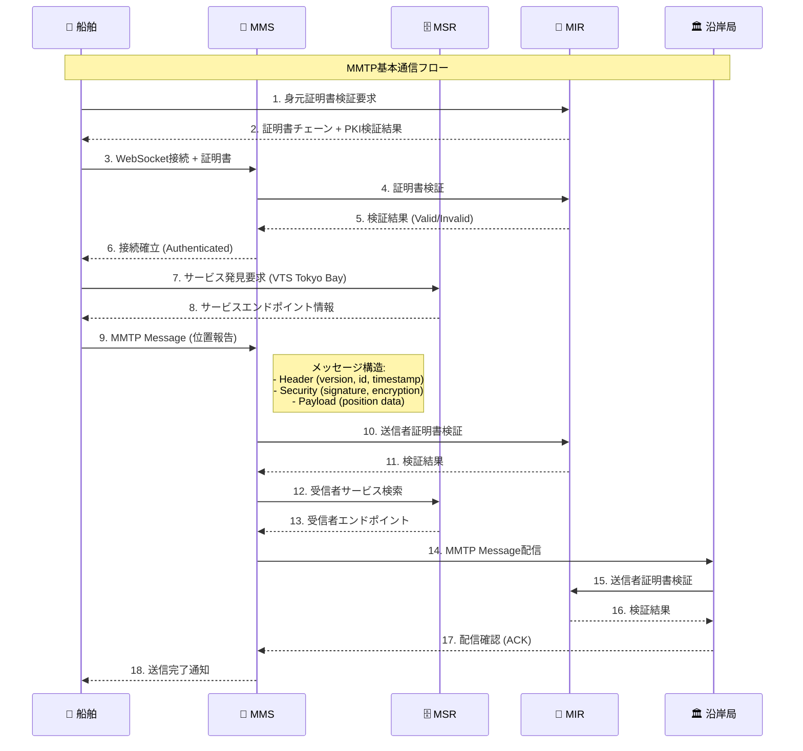
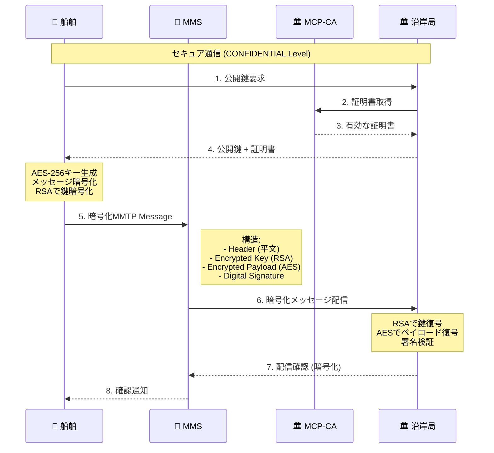
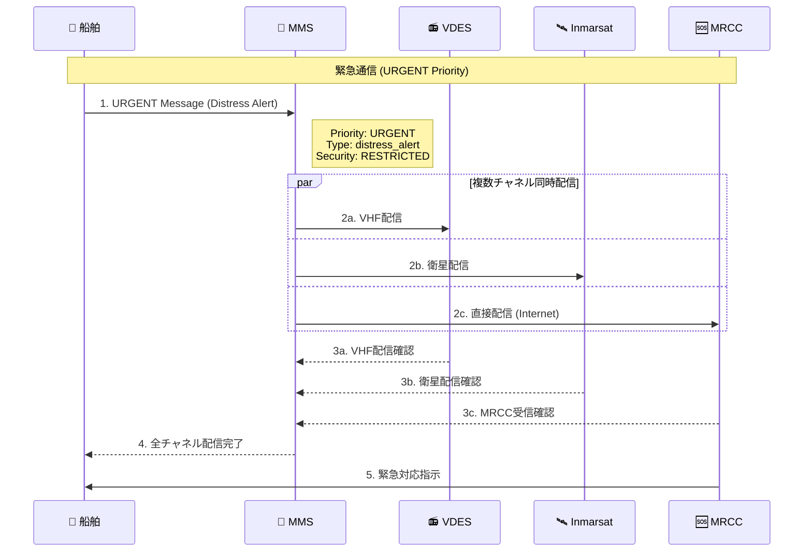
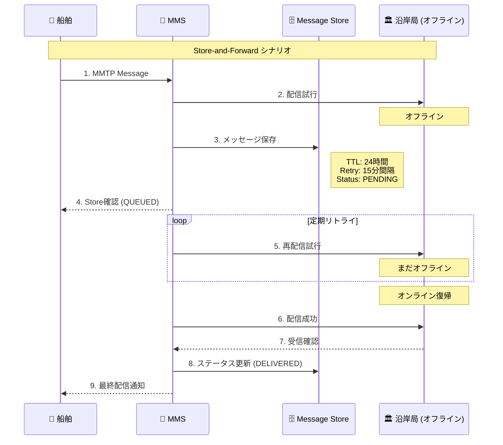
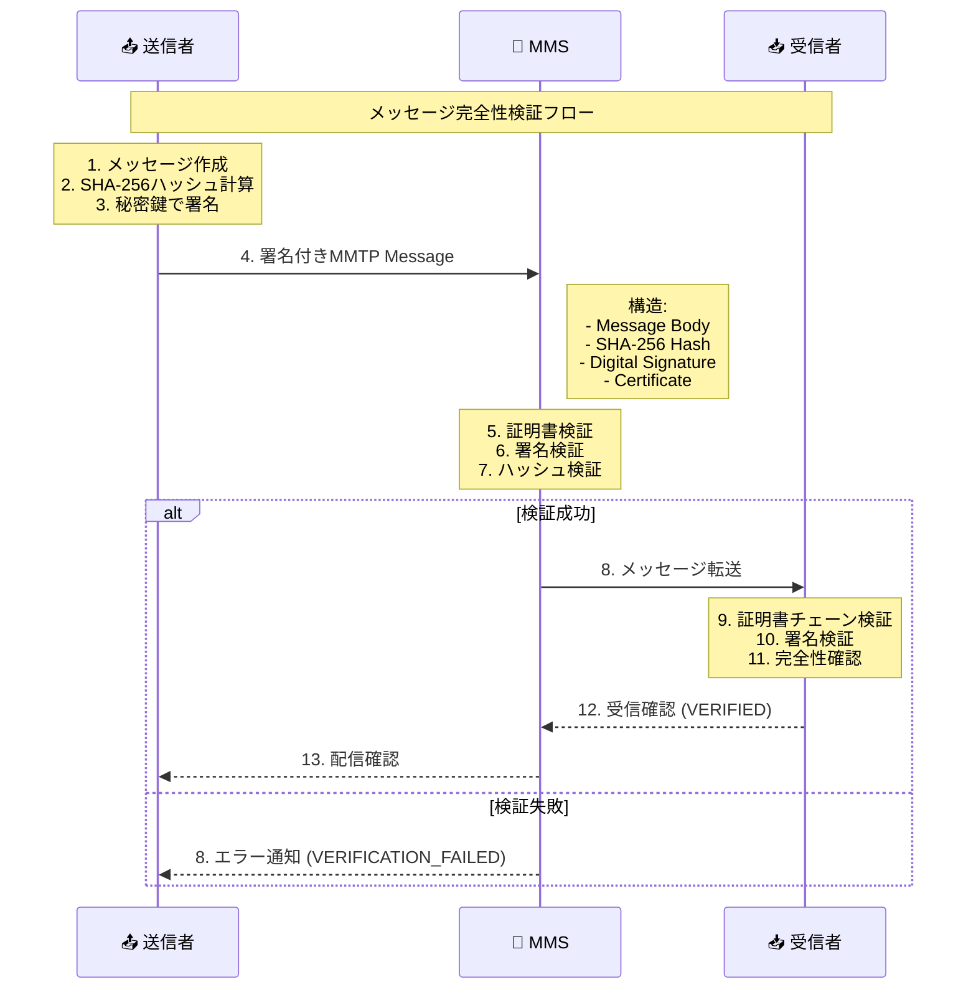
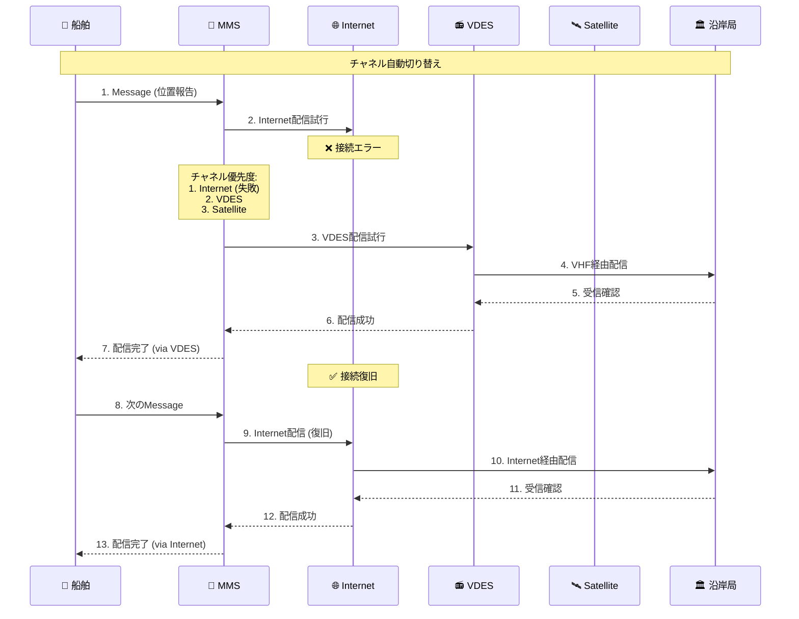

# MMTP準拠通信シーケンス図

Maritime Message Transfer Protocol (MMTP)に準拠した完全な通信フローを図示します。

## 1. 基本メッセージ送信シーケンス



## 2. セキュアメッセージング（暗号化）



## 3. 緊急メッセージ配信



## 4. Store-and-Forward機能



## 5. メッセージ完全性検証



## 6. マルチチャネル自動切り替え



## メッセージ構造詳細

### MMTPヘッダー構造
```yaml
header:
  version: "1.0"
  message_id: "uuid-v4"
  correlation_id: "optional"
  timestamp: "ISO-8601"
  ttl: 86400  # seconds
  priority: "NORMAL|HIGH|URGENT"
  security_level: "PUBLIC|RESTRICTED|CONFIDENTIAL|SECRET"
  
sender:
  mrn: "urn:mrn:mcp:vessel:imo:1234567"
  certificate: "X.509 Certificate"
  
recipient:
  mrn: "urn:mrn:mcp:shore:authority:vts:tokyo-bay"
  
payload:
  message_type: "position_report"
  subject: "位置報告"
  body: "緯度: 35.6762, 経度: 139.6503..."
  metadata: {}
  
security:
  digital_signature: "base64-encoded"
  encryption_algorithm: "AES-256-GCM"
  encrypted_key: "RSA-encrypted AES key"
```

## 実装での考慮点

1. **証明書検証**: すべてのメッセージで送信者証明書を検証
2. **暗号化**: CONFIDENTIAL以上のセキュリティレベルで必須
3. **配信保証**: TTL内での配信確認とリトライ機構
4. **チャネル冗長性**: 複数通信チャネルでの自動フェイルオーバー
5. **監査ログ**: すべての通信を改ざん防止ログに記録

このMMTP準拠実装により、商用レベルの海事通信システムが構築できます。